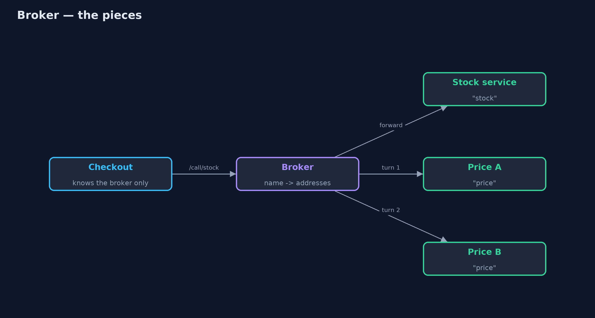
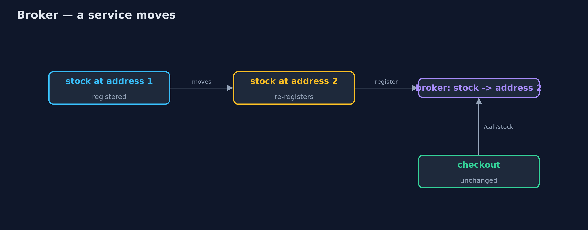

# Broker Pattern

```
src/main/java/com/jk/explore/broker/
├── Broker.java      The pattern: a go-between that knows where every service lives
├── BrokerDemo.java  The five acts: hard-coded addresses, calls through a broker, a service that moves, several instances, and the bill
├── Http.java        Small helpers: start a local web server, reply to a request, and make a GET request
└── Services.java    The shop's back-end services, each a small web server that answers one kind of question
```

**Put a broker between clients and services: services register by name, clients call by name, and the broker finds the service and forwards the call.**

Broker is an architectural pattern for distributed systems. Clients do not
know where the services they use are running. Instead, each service registers
with a broker under a name, and clients send their calls to the broker, by
name. The broker finds a live instance of that service, forwards the call and
returns the answer.

Services can then move, be added or be replaced without any client changing.
The same idea underlies Java RMI's registry, CORBA, and today's service
registries and service meshes.

## The idea in everyday terms

Think of an old hotel switchboard. Guests do not know which extension the
kitchen or the laundry is on; they ask the operator to put them through to
room service. When room service moves to a new office, only the operator's
list changes. But if the switchboard goes down, nobody can call anyone.

## The scenario

The online store's checkout calls a stock service and a price service. Their
addresses were written into checkout's configuration. When the stock service
was moved to a new machine, checkout kept calling the old address and every
order failed until checkout was changed and released.

## Run

```bash
./gradlew run
```

The demo tells the story in 5 acts, each printing exact numbers that the tests check:

| Act | What it shows |
| --- | --- |
| 1. A hard-coded address | Checkout calls the stock service at a fixed address: 4 kettles; the service moves, and checkout fails with connection refused. |
| 2. Calls through a broker | The stock service registers as "stock"; checkout calls /call/stock and gets 4; it knows only the broker. |
| 3. A service moves | The stock service moves and re-registers; checkout, unchanged, asks for MUG-1 and gets 20. |
| 4. Several instances | Two price instances registered: four calls alternate price-a, price-b, price-a, price-b. |
| 5. The bill | One call is 2 network requests; when the broker stops, every service is unreachable. |

## Test

```bash
./gradlew test
```

6 tests in `BrokerTest`, `DemoRunsTest`. Every number the demo prints is asserted, and nothing depends on the clock, so every run gives the same result.

## Technologies and versions

| Technology | Version | Used for |
| --- | --- | --- |
| Java | 21 | the code (toolchain set in `build.gradle`) |
| Gradle | 9.2.1 (wrapper) | build and run, nothing to install |
| JUnit | 5.10.2 | the tests |
| videokit | repository tool | the narrated video and animation: Piper `en_US-amy-medium`, speed 0.8, longer pauses (the approved `amy-slow` voice) |

## Learning Material

| Document | What it is for |
| --- | --- |
| [Problem statement](docs/problem-statement.md) | the situation and what the project must show |
| [Prerequisites](docs/prerequisites.md) | what you need to know first |
| [Broker, explained](docs/broker-pattern-explained.md) | the acts in prose |
| [Session guide](docs/session.md) | a one-hour lesson with exercises |
| [Animated walkthrough](docs/animation.html) | the acts step by step, narrated |
| [Spec](docs/spec.md) | what this project must be true of |

### The pattern in one picture

Clients call the broker by name; the broker knows the addresses.



### Where each piece sits

A registry of names and a forwarding endpoint.


### How the data moves

Only the broker's list changes.



### Who calls whom, in order

Two hops, one answer.


### Video

`video/broker-pattern-explained.mp4` (with `.m4a` audio and `.srt` subtitles) is built by `video/build_video.sh`. Rendered media is not committed.

## What it costs

- **An extra hop.** Every call is two network requests: client to broker, broker to service.
- **One thing everyone needs.** When the broker stopped, every service became unreachable; real brokers run several copies.
- **Another system to run.** The broker must be monitored, secured and kept fast.

## When this is too much

With a handful of services that never move, configured addresses are simpler.
And many platforms already do this job: Kubernetes services and DNS, or a
service registry with a client-side load balancer, which avoids the extra hop.

## Where you have already met this

- Java RMI's registry and CORBA's object request broker.
- Service registries such as Consul, Eureka and etcd.
- Kubernetes services, which give a stable name to moving pods.
- API gateways and service meshes that route calls by name.

## Where this sits

This project is in [architectural-design-patterns](..). Similar ideas appear
as [Service Discovery](../../micro-services-design-patterns/service-discovery-pattern)
and [API Gateway](../../micro-services-design-patterns/api-gateway-pattern) in
the microservices category.
