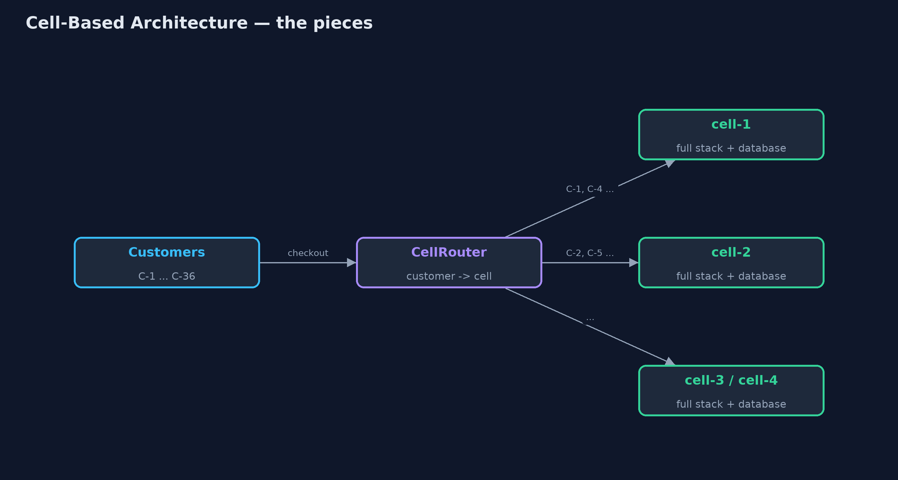
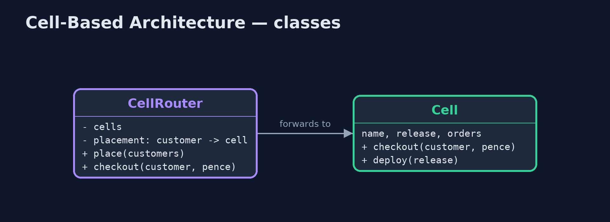
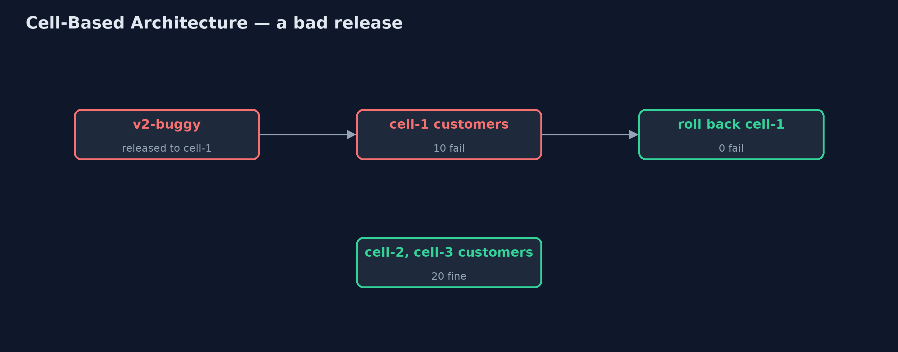
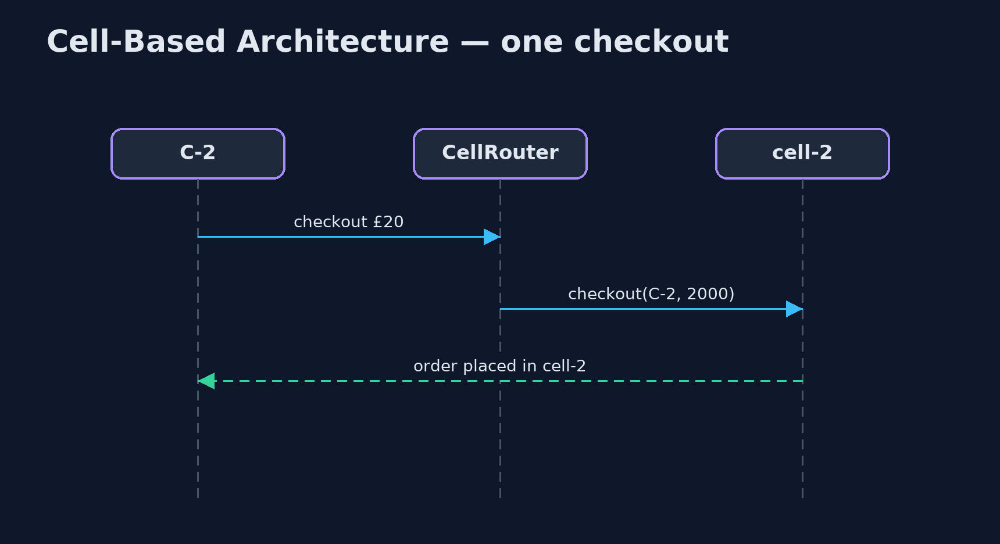

# Cell-Based Architecture Pattern

```
src/main/java/com/jk/explore/cellbased/
├── Cell.java           A complete copy of the shop's back end (checkout, orders, its own database) serving only the customers placed in it
├── CellBasedDemo.java  The five acts: one shared stack, cells behind a router, a bad release in one cell, a new cell, and the bill
└── CellRouter.java     The pattern's thin front door: knows which cell each customer lives in, and sends every request there
```

**Run the whole system as several complete, independent copies called cells, each serving its own share of customers, so a failure or a bad release only ever reaches one cell.**

Cell-based architecture splits a system into cells: complete, independent
copies of the whole back end (services, databases, queues), each serving a
fixed share of the customers. A thin router in front knows which cell each
customer lives in and sends every request there. Cells share nothing with each
other.

When something goes wrong in a cell, whether a crash, a bad release or an
overload, only that cell's customers notice. Releases can go to one cell
first. And the system grows by adding cells rather than by making one copy
ever bigger.

## The idea in everyday terms

Think of a restaurant chain with branches in different neighbourhoods. Each
branch has its own kitchen, staff and stock, and regulars always go to their
local branch. If one branch's oven breaks, only that branch closes for the
evening. A new recipe is tried in one branch first. And when a new
neighbourhood grows, the chain opens another branch rather than doubling the
size of one kitchen.

## The scenario

The online store ran as one shared stack for every customer. When a release
with a checkout bug went out, every customer in the country was unable to
check out until it was rolled back.

## Run

```bash
./gradlew run
```

The demo tells the story in 5 acts, each printing exact numbers that the tests check:

| Act | What it shows |
| --- | --- |
| 1. One shared stack | A release with a checkout bug on the one shared stack: 30 of 30 customers cannot check out. |
| 2. Cells | Three complete cells, 10 customers each; the router sends C-1 to cell-1, C-2 to cell-2; 0 failures. |
| 3. A small blast radius | The buggy release goes to cell-1 first: 10 of 30 fail; after rollback, 0; cells 2 and 3 never noticed. |
| 4. Add a cell | Cell-4 is added; 6 new customers are placed there; C-1 stays in cell-1; nobody is moved. |
| 5. The bill | Today's total sales means asking all 4 cells (£1760.00); 4 copies of everything to run. |

## Test

```bash
./gradlew test
```

7 tests in `CellRouterTest`, `DemoRunsTest`. Every number the demo prints is asserted, and nothing depends on the clock, so every run gives the same result.

## Technologies and versions

| Technology | Version | Used for |
| --- | --- | --- |
| Java | 21 | the code (toolchain set in `build.gradle`) |
| Gradle | 9.2.1 (wrapper) | build and run, nothing to install |
| JUnit | 5.10.2 | the tests |
| videokit | repository tool | the narrated video and animation: Piper `en_US-amy-medium`, speed 0.8, longer pauses (the approved `amy-slow` voice) |

## Learning Material

| Document | What it is for |
| --- | --- |
| [Problem statement](docs/problem-statement.md) | the situation and what the project must show |
| [Prerequisites](docs/prerequisites.md) | what you need to know first |
| [Cell-Based Architecture, explained](docs/cell-based-pattern-explained.md) | the acts in prose |
| [Session guide](docs/session.md) | a one-hour lesson with exercises |
| [Animated walkthrough](docs/animation.html) | the acts step by step, narrated |
| [Spec](docs/spec.md) | what this project must be true of |

### The pattern in one picture

A thin router in front of independent cells.



### Where each piece sits

The router places customers and forwards to their cell.



### How the data moves

Only one cell's customers are affected.



### Who calls whom, in order

The router looks up the customer's cell.



### Video

`video/cell-based-pattern-explained.mp4` (with `.m4a` audio and `.srt` subtitles) is built by `video/build_video.sh`. Rendered media is not committed.

## What it costs

- **Questions across cells.** "Today's total sales" means asking every cell and adding up.
- **More copies to run.** Four cells mean four copies of every service and database to run, watch and pay for.
- **Moving customers is hard.** Moving a customer between cells means moving their data too.

## When this is too much

A system with modest traffic, where an outage for everyone is acceptable for a
short time, is simpler as one stack. Cells pay off for large systems where
limiting the blast radius of failures and releases is worth running many
copies.

## Where you have already met this

- AWS's cell-based architecture guidance, used in services such as DynamoDB.
- Slack's and Salesforce's "pods" and "cells", each serving a set of customers.
- Staged rollouts that release to one region or one cell first.

## Where this sits

This project is in [architectural-design-patterns](..), next to
[Space-Based Architecture](../space-based-pattern), which scales by copying
data between identical units, and near
[Bulkhead](../../micro-services-design-patterns/bulkhead-pattern), which
isolates failures inside one service.
