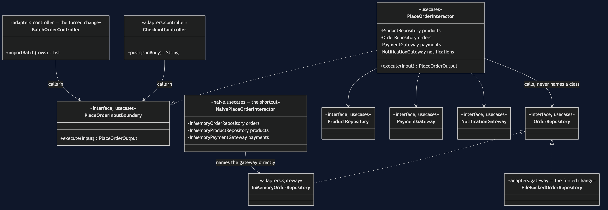
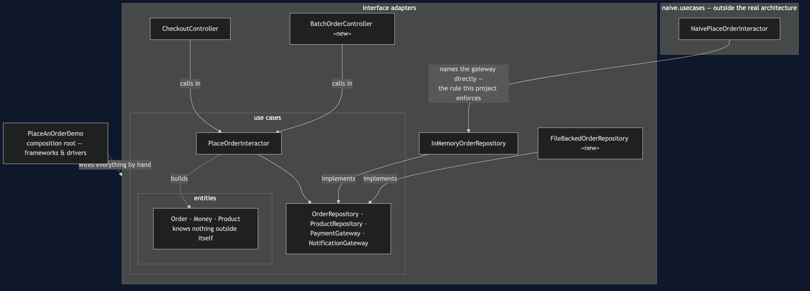
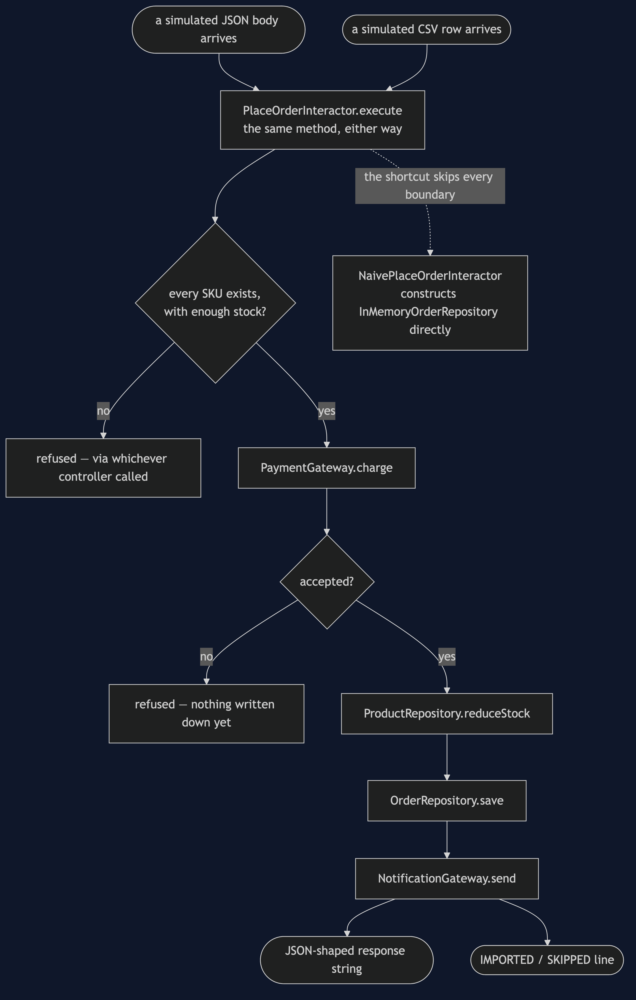
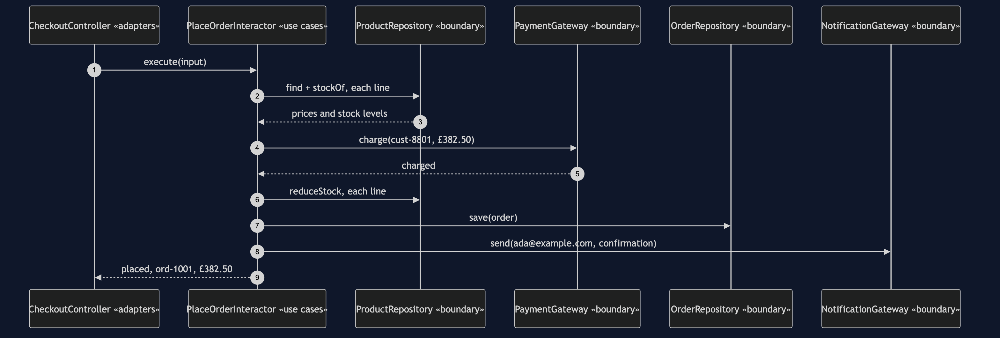
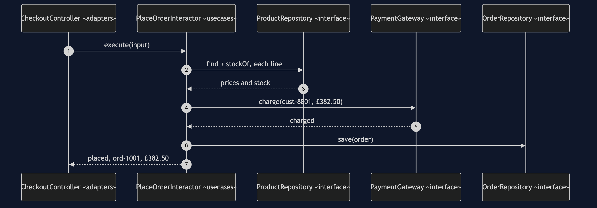
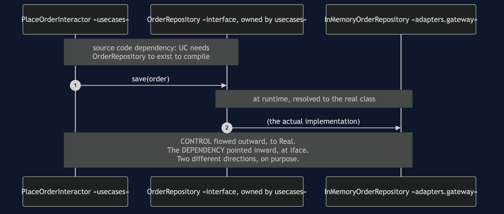
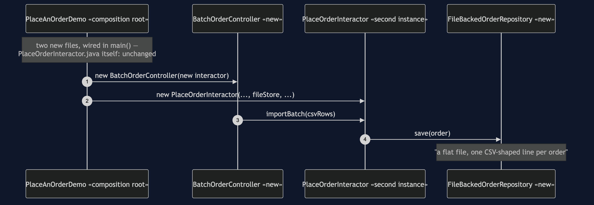
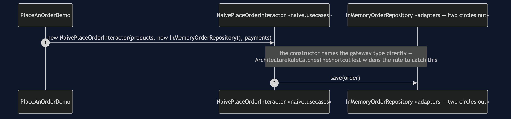

# Clean Architecture Pattern

```
src/main/java/com/jk/explore/clean/
├── PlaceAnOrderDemo.java          composition root — wires by hand, no container
├── ForcedChange.java              counts the bill, from real files on disk
│
├── entities/                      ← innermost circle, depends on nothing
│   └── Order, OrderLine, Money, Product, OrderStatus, CheckoutRefusedException
│
├── usecases/                      ← depends only on entities
│   ├── PlaceOrderInputBoundary.java · PlaceOrderInteractor.java
│   ├── PlaceOrderInput.java · PlaceOrderOutput.java    (DTOs crossing the boundary)
│   └── OrderRepository.java · ProductRepository.java   ← interfaces, declared HERE
│       PaymentGateway.java · NotificationGateway.java
│
├── adapters/                      ← reaches up to usecases, never the reverse
│   ├── controller/
│   │   ├── CheckoutController.java
│   │   └── BatchOrderController.java     the forced change — new delivery
│   └── gateway/
│       ├── InMemoryOrderRepository.java · InMemoryProductRepository.java
│       ├── InMemoryPaymentGateway.java · InMemoryNotificationGateway.java
│       └── FileBackedOrderRepository.java    the forced change — new data source
│
└── naive/usecases/                ← kept on purpose, outside the real architecture
    └── NaivePlaceOrderInteractor.java     the shortcut — names gateways directly
```

`src/test/java/.../clean/ArchitectureTest.java` checks the one rule that
matters, using ArchUnit's own layered-architecture API: source code
dependencies point only inward, entities ← use cases ← adapters, never the
other way.

**Concentric circles — entities, use cases, interface adapters, frameworks
and drivers — with one rule: source code dependencies point only inward.**

This is project 66 of [architectural-design-patterns](..), one step from
[Hexagonal Architecture](../hexagonal-architecture-pattern) — the same
inversion, generalised into three named rings, with the dependency-
inversion moment shown in code and the largest forced change in the
category: an entirely new delivery mechanism and an entirely new data
source, added at the same time.

## Run

```bash
./gradlew run
```

Five acts.

```
THREE. The arrow flips. The call does not.
  interactor calls: orders.save(order)
  orders is typed as: usecases.OrderRepository (an interface)
  declared in usecases. implemented in adapters.gateway.
  control flows OUT, to whichever gateway was wired in.
  the dependency points IN, at an interface usecases owns.
  those are two different directions, on purpose.

FOUR. Add a delivery mechanism AND a data source, at once.
  IMPORTED ord-1001 £249.00
  store: a flat file, one CSV-shaped line per order
  PlaceOrderInteractor.java: zero lines changed.
  CheckoutController.java: zero lines changed.
```

```
FIVE. The rule, and the bill.
  ...
  FORCED CHANGE: a new delivery mechanism AND a new
  data source, added at the same time
    HTTP-shaped checkout  +  a batch CSV importer
    a map                 +  a flat, file-shaped store

    files added     : 2   adapters/controller/BatchOrderController.java, adapters/gateway/FileBackedOrderRepository.java
    files modified  : 1   PlaceAnOrderDemo.java (the composition root)
    lines changed   : 5
    classes in entities + use cases : 15
    of those, opened                : 0
    of those, never opened           : 15
```

And the acceptance line every project in this category prints identically:

```
ACCEPTANCE
  order ord-1001 for cust-8801: PLACED, 3 lines, £382.50
  stock ESP-001 3, GRD-014 1, BNS-220 38
  charged cust-8801 £382.50 once
  sent 1 confirmation to ada@example.com
  refused: not enough stock, unknown product, payment declined
```

## Test

```bash
./gradlew test
```

Sixteen tests. One checks the whole concentric rule via
`Architectures.layeredArchitecture()`; another widens an equivalent rule to
`naive.usecases` and asserts the failure names
`NaivePlaceOrderInteractor`. `BothAddedAtOnceTest` proves — rather than
narrates — the forced change's claim: the original HTTP-and-map path and
the new batch-and-file path both work, in the same test run, from the same
`PlaceOrderInteractor` class.

## Technologies and versions

| What | Version | Why it is here |
| --- | --- | --- |
| Java | 21 | The repository standard |
| Gradle | 9.2.1 | The wrapper in this directory |
| JUnit 5 | 5.10.2 | Test runner |
| ArchUnit | 1.5.0 | Test-only. The concentric rule is written with `Architectures.layeredArchitecture()`, ArchUnit's own API for this shape |

No Spring, no dependency injection container, no real HTTP, no real file
system. The whole object graph is wired by hand in `main()`. For the same
graph assembled by a container, see
[`clean-architecture-with-spring-pattern`](../clean-architecture-with-spring-pattern).

## Learning Material

| Document | What it covers |
| --- | --- |
| [`docs/problem-statement.md`](docs/problem-statement.md) | The naive interactor, and what it costs |
| [`docs/clean-architecture-pattern-explained.md`](docs/clean-architecture-pattern-explained.md) | The four circles, the four genuine differences from Hexagonal, the inversion moment, the forced change, the bill |
| [`docs/class-diagram.md`](docs/class-diagram.md) | The types, and which arrows point inward |
| [`docs/architecture-diagram.md`](docs/architecture-diagram.md) | The three rings, nested |
| [`docs/data-flow-diagram.md`](docs/data-flow-diagram.md) | One order, entering through either controller |
| [`docs/sequence-diagram.md`](docs/sequence-diagram.md) | Who calls whom — written for a listener with the screen off |
| [`docs/uml-diagram.md`](docs/uml-diagram.md) | Four sequences: the real graph, the inversion moment isolated, the forced change, the shortcut |
| [`docs/animation.html`](docs/animation.html) | Five steps in a browser |
| [`docs/prerequisites.md`](docs/prerequisites.md) | What you need to know, and what you explicitly do not |
| [`docs/session.md`](docs/session.md) | A one-hour taught session with three exercises |
| [`docs/spec.md`](docs/spec.md) | The generated specification |
| [`docs/youtube.md`](docs/youtube.md) | Title, description and chapters |

### The pattern in one picture

Four boundaries, all declared in `usecases`; two controllers and two
gateways all pointing at the same two interfaces — the forced change made
visible as a fan-in rather than a swap.



### The three rings, nested

Every arrow crossing a ring boundary points toward the centre.



### How one order enters from either side

Two controllers, one interactor, formatted differently only at the very
last step.



### Who calls whom, in order

The sequence written to work with the screen off: every name the use case
speaks is a name it chose itself.



### All four sequences

The full set from [`docs/uml-diagram.md`](docs/uml-diagram.md).

**One. The real graph, wired by hand.**



**Two. The dependency-inversion moment, isolated.**



**Three. The forced change — both new, nothing old touched.**



**Four. The shortcut — a use case that names its gateways.**



### Video

Built from [`video/scenes.py`](video/scenes.py) by
[`video/build_video.sh`](video/build_video.sh). The rendered file is not
committed.

## When this is too much

**This is the most over-applied pattern in the category, and the bill is
correspondingly the largest.** Fourteen files for one checkout feature —
two DTOs, four boundaries, one interactor, two controllers, four gateways.
Worth it for long-lived systems with more than one real delivery mechanism
or data source, and a domain worth protecting. Not worth it for almost
everything smaller than that: a CRUD screen built this way has more
interfaces than behaviour.

## Where this sits

Project 66 of [`architectural-design-patterns`](..), one step from
[Hexagonal Architecture](../hexagonal-architecture-pattern). A companion
project, **Clean Architecture with Spring**, assembles this identical
graph — same entities, same use cases, same adapters — with a container
instead of by hand, to contrast compile-time wiring failure against
startup-time wiring failure. It depends on this project being built and
published first, since it is only legible to someone who has already seen
the hand-wiring.
