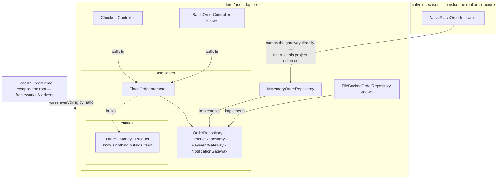

# Clean Architecture Pattern — Architecture Diagram

Read it as three concentric rings around one centre, drawn here as nested
boxes because Mermaid draws boxes rather than circles: entities innermost,
use cases around them, adapters around those. Every arrow crossing a
boundary points inward.

Mermaid source

## Reading The Diagram

**Three rings, nested, and every arrow that crosses a ring boundary points
toward the centre.** Controllers call the use case; gateways implement its
boundaries. Nothing inside `usecases` has an arrow reaching out to
`adapters`.

**Two controllers and two gateways sit in the same outer ring, and both
pairs point at the same inner boundary.** That is the forced change,
drawn: addition, not replacement — the originals are still there, still
working.

**The dashed box sits entirely outside the rings.**
`NaivePlaceOrderInteractor`'s one outward arrow is the line
`ArchitectureRuleCatchesTheShortcutTest` widens the dependency rule to
catch.
