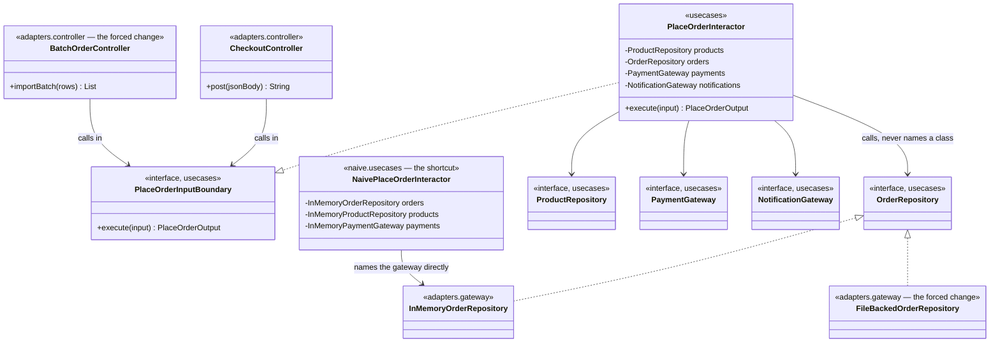

# Clean Architecture Pattern — Class Diagram

The single most important thing on this diagram is the direction of every
arrow between the three rings. Every arrow from `adapters` lands on an
interface in `usecases`, or on a type in `entities`. Not one arrow leaves
`usecases` for `adapters` — except in the dashed naive box.

Mermaid source

## Reading The Diagram

**`PlaceOrderInteractor` has four outgoing arrows, all landing on
interfaces it declares itself.** Neither `CheckoutController` nor
`BatchOrderController` appears anywhere near it — a controller calls the
input boundary, never the interactor by name.

**Two controllers, and two order-repository implementations, all pointing
at the same two interfaces.** That fan-in is the forced change made
visible: neither addition needed a new interface, only a new
implementation of one that already existed.

**`NaivePlaceOrderInteractor` is the only class here with an arrow to a
concrete gateway from something calling itself a use case.** That single
misdirected arrow is what `ArchitectureRuleCatchesTheShortcutTest` exists
to catch.
