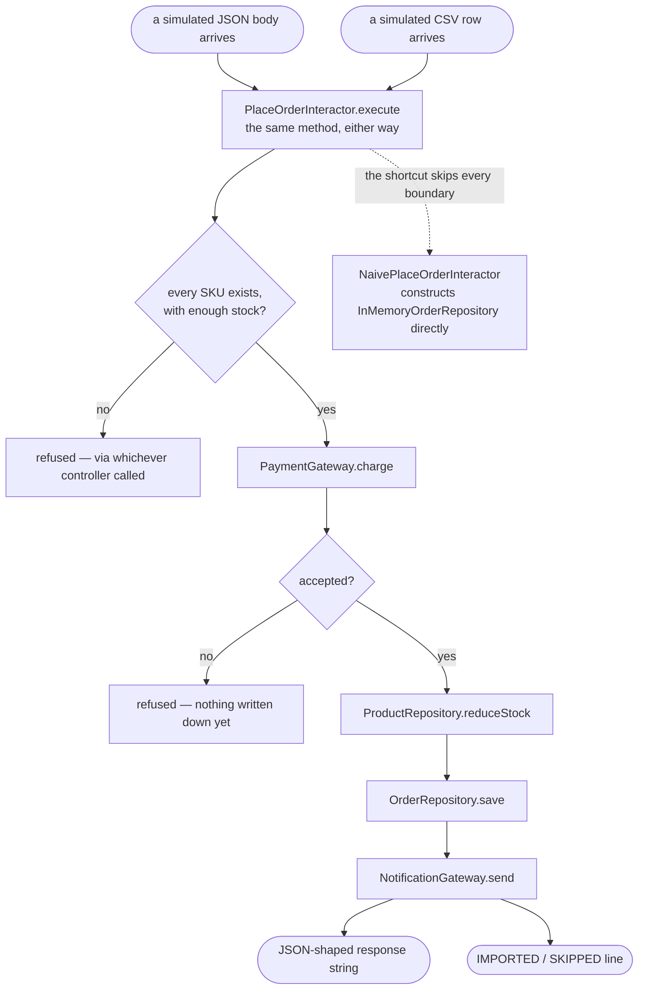

# Clean Architecture Pattern — Data Flow Diagram

One order, entering through either of two controllers, flowing through one
unchanged interactor, and leaving through the boundaries it declared.

Mermaid source

## Reading The Diagram

**Two arrows enter `UC` from the top, and both go to the same box.**
Whichever controller received the call, `PlaceOrderInteractor.execute` runs
identically.

**`Save` has two different gateways it might really be talking to,
depending only on how the composition root wired this particular
instance** — the diagram cannot show that choice, because the interactor
itself cannot see it either.

**The dashed line to `Shortcut` does not pass through `Check`, `Charge`, or
any gate on this page.** `NaivePlaceOrderInteractor` is drawn reaching
around the whole diagram to construct a gateway directly, which is exactly
the shortcut the architecture test exists to catch.
