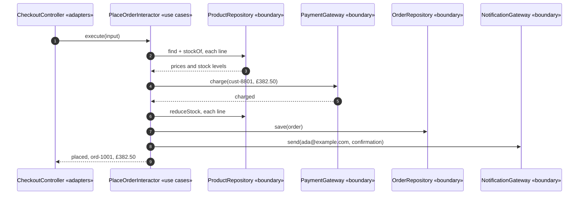

# Clean Architecture Pattern — Sequence Diagram

One order, driven in from outside, in the order the calls actually
happen — written so a listener with the screen off can follow who calls
whom.

Say it in words. A controller receives a request and calls one method on
the use case's own boundary interface, handing it plain data — a customer
id, some lines, a contact address — never an entity. The use case checks
stock through an interface it declared, takes payment through an interface
it declared, saves the order through an interface it declared, and sends a
notification through an interface it declared. Every name the use case
speaks in this sequence is a name the use case itself chose. The classes
that really do the storing and the charging are never mentioned, because
the use case has no way to mention them — it has never seen their names.

Mermaid source

Say the load-bearing sentence aloud, because it is the one a picture cannot
carry on its own: **control flows outward to whichever gateway was wired
in, but the source code dependency the interactor carries points inward,
at an interface it declared itself.** Those are two different directions,
and Clean Architecture's whole trick is letting them disagree.

For the same sequence with a batch controller and a file-backed store
added beside these, and the naive shortcut, see
[`uml-diagram.md`](uml-diagram.md).
