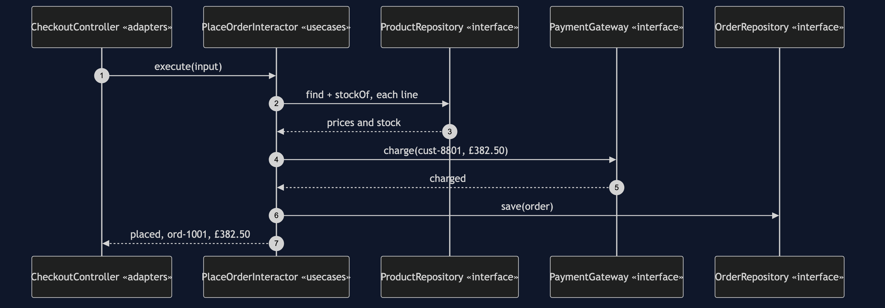
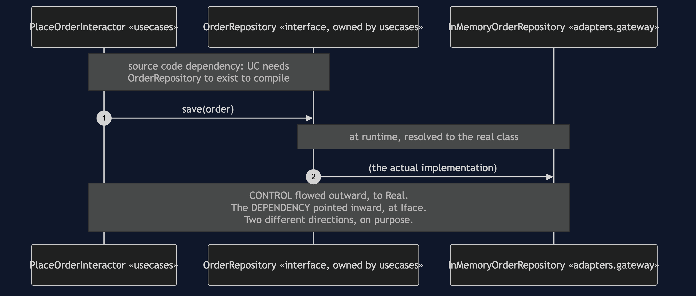
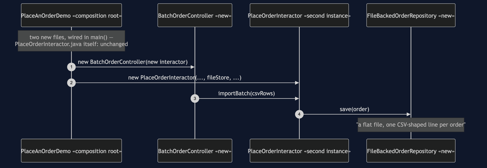
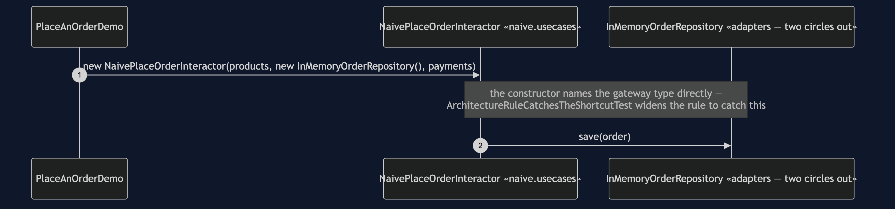

# Clean Architecture Pattern — UML Sequence Diagrams

Four sequences: the real graph running, the dependency-inversion moment
isolated, the forced change, and the naive shortcut.

## 1. The Real Graph, Wired By Hand

## 2. The Dependency-Inversion Moment, Isolated

## 3. The Forced Change — Both New, Nothing Old Touched

## 4. The Shortcut — A Use Case That Names Its Gateways

