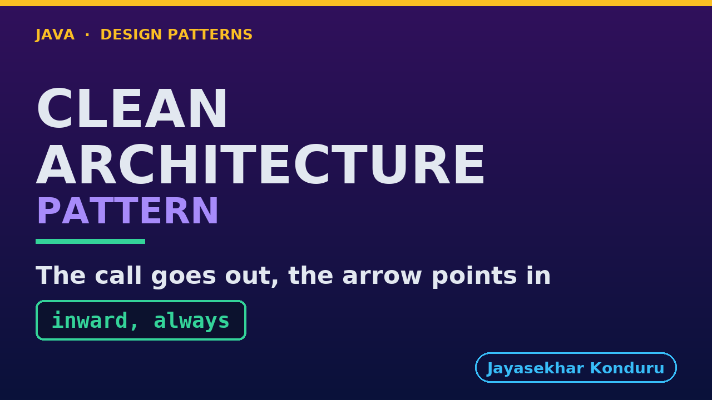

# YouTube — Clean Architecture Pattern

Everything needed to publish `video/clean-architecture-pattern-explained.mp4`. Copy the fields straight out of this file.

Chapter timings are generated from the video's `.srt`. Re-run `python3 docs/make_youtube_docs.py clean-architecture` after any change to the narration, or they will be wrong.

## Title

```
Clean Architecture in Java - Which Way Does It Point?
```

53 characters — under the 60 YouTube shows before truncating in search results.

## Description

The first two lines are what a viewer sees above the fold, so they carry the hook rather than the boilerplate.

```
Clean Architecture in Java: the program is arranged in rings, with the business rules at the centre and the technical details on the outside, and one rule holds it together: code may only depend on things further in. Explained through an online shop that places an order. We start from a naive version, wire the real graph by hand, and find the dependency-inversion moment the whole pattern rests on. We add two features at once, write the rule as an ArchUnit test, watch it go red, and finish with the honest bill and when the pattern is too much. Control flows outward, the dependency points inward, and that disagreement is the whole pattern.

CHAPTERS
00:00 Introduction
00:55 The Scenario
01:32 The Naive Version
02:09 Four Circles, One Rule
02:59 This Is Not Hexagonal Again
03:46 The Real Graph, Wired By Hand
04:27 The Dependency-Inversion Moment
05:20 Wired By Hand, On Purpose
06:00 Add Two Things At Once
06:46 Both Paths, Proven Rather Than Narrated
07:17 The Rule, As ArchUnit's Own API
07:56 Watching It Go Red
08:21 The Bill
09:00 When This Is Too Much
09:33 Thanks for Watching

SOURCE CODE, WRITTEN NOTES AND AN INTERACTIVE ANIMATION
https://github.com/jk-boot-up/java-design-patterns/tree/main/gradle-java/architectural-design-patterns/clean-architecture-pattern

WHAT YOU NEED FIRST
Java 21 and a working knowledge of classes and interfaces. No prior design-pattern knowledge is assumed. The full prerequisites are in docs/prerequisites.md in the repository.
```

## Chapters

YouTube renders these as chapters only if there are at least three and the first is at `00:00`.

```
00:00 Introduction
00:55 The Scenario
01:32 The Naive Version
02:09 Four Circles, One Rule
02:59 This Is Not Hexagonal Again
03:46 The Real Graph, Wired By Hand
04:27 The Dependency-Inversion Moment
05:20 Wired By Hand, On Purpose
06:00 Add Two Things At Once
06:46 Both Paths, Proven Rather Than Narrated
07:17 The Rule, As ArchUnit's Own API
07:56 Watching It Go Red
08:21 The Bill
09:00 When This Is Too Much
09:33 Thanks for Watching
```

## Tags

```
clean architecture, dependency inversion, dependency rule, design patterns, java design patterns, gang of four, java 21, software design, clean code, object oriented design, java tutorial, ecommerce, programming tutorial
```

220 characters, under YouTube's 500 limit.

## Thumbnail



**Upload `docs/thumbnail.png`** — 1280×720, the size YouTube recommends, generated by `docs/make_thumbnails.py`. It is deliberately not the same image as the video's opening frame: a thumbnail is judged at about 360 pixels wide in a search result, so this one carries only the pattern name, one line of promise and one short piece of code, each set large enough to survive the shrink.

`video/poster.png` is the 1920×1080 opening frame, produced by the video build. It stays in the repository as the title card; it is not what gets uploaded.

YouTube will not pick the thumbnail up on its own — upload it under **Details → Thumbnail → Upload file**. A custom thumbnail requires a verified channel.

## Upload checklist

- [ ] Upload `video/clean-architecture-pattern-explained.mp4` (1080p, H.264, 30 fps, AAC 48 kHz — already YouTube's recommended settings, no re-encode needed)
- [ ] Set the video language to **English** first, or the subtitle option may not appear
- [ ] Add subtitles: *Video elements → Add subtitles → Upload file → With timing* → `video/clean-architecture-pattern-explained.srt`
- [ ] Upload `docs/thumbnail.png` as the thumbnail — do not let YouTube auto-pick a frame
- [ ] Paste the title, description and tags from above
- [ ] Add to the **Java Design Patterns** playlist, in learning order
- [ ] Wait for 1080p processing before sharing the link — code slides are unreadable at 360p

## Cards and end screen

End screen links to whichever pattern video goes up next — set it at upload time rather than assuming an order.

Add a card partway through pointing at the playlist, so a viewer who arrives at this pattern from search can find the rest of the series.

## Runtime

Approximately 10:17, narrated at 145 words per minute.
