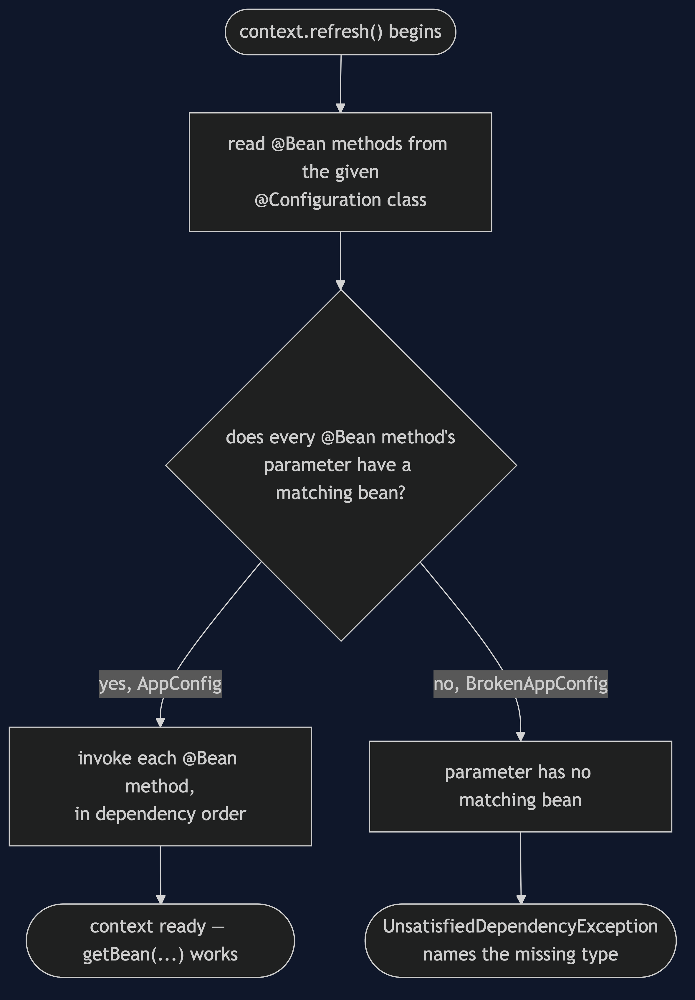
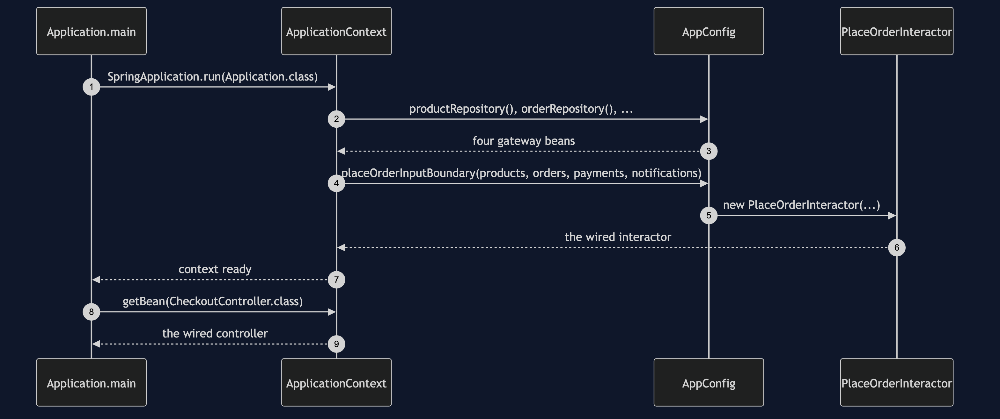
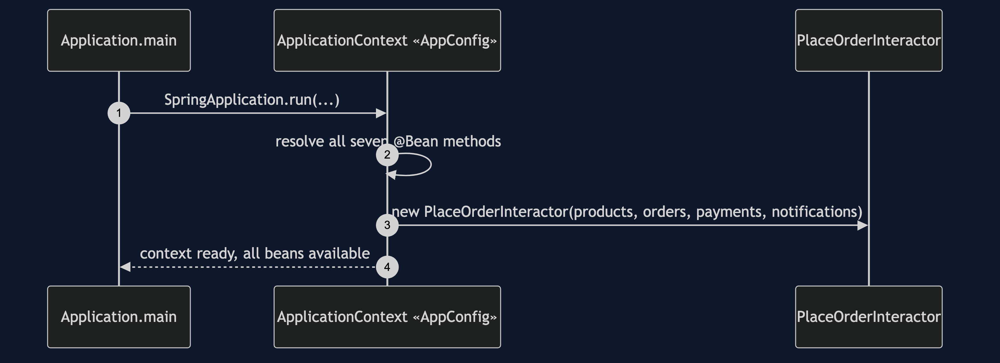
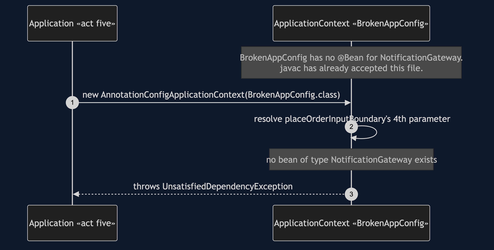

# Clean Architecture with Spring Pattern

```
src/main/java/com/jk/explore/cleanspring/
├── Application.java               @SpringBootApplication — the five acts
│
├── config/                        ← the ONLY new circle. Spring lives here alone.
│   ├── AppConfig.java               @Bean per object — Spring's version of shop()
│   └── BrokenAppConfig.java         identical, minus one @Bean — the forced failure
│
├── entities/                      ← UNCHANGED from clean-architecture-pattern
├── usecases/                      ← UNCHANGED from clean-architecture-pattern
├── adapters/                      ← UNCHANGED from clean-architecture-pattern
│   ├── controller/  CheckoutController.java · BatchOrderController.java
│   └── gateway/     InMemory*.java · FileBackedOrderRepository.java
│
└── naive/usecases/                ← UNCHANGED — the shortcut, for the same test
    └── NaivePlaceOrderInteractor.java
```

Every file under `entities/`, `usecases/`, `adapters/` and `naive/` is
`clean-architecture-pattern`'s file, copied without a single line changed.
`src/test/java/.../cleanspring/ArchitectureTest.java` checks the same
concentric rule — and a second rule asserting Spring appears nowhere in
those four packages, only in `config/` and `Application.java`.

**§66's identical graph, wired by a container instead of by hand — so the
one contrast a container adds can be shown directly: hand-wiring fails at
compile time; container wiring fails at startup.**

This is project 67 of [architectural-design-patterns](..), and it depends
on [Clean Architecture](../clean-architecture-pattern) — §66 — being
watched first, always. It is only legible to someone who has already seen
the hand-wiring.

## Run

```bash
./gradlew run
```

Five acts, plus the scene this project exists for.

```
FIVE. Hand-wiring fails at compile time.
  Container wiring fails at startup.
  removing an argument from PlaceAnOrderDemo's hand-wired
  new PlaceOrderInteractor(...) does not compile.
  removing @Bean notificationGateway() compiles cleanly --
  watch what happens when the container starts instead:
  STARTUP FAILED: No qualifying bean of type
  'com.jk.explore.cleanspring.usecases.NotificationGateway' available:
  expected at least 1 bean which qualifies as autowire candidate.
```

And the acceptance line every project in this category prints identically:

```
ACCEPTANCE
  order ord-1001 for cust-8801: PLACED, 3 lines, £382.50
  stock ESP-001 3, GRD-014 1, BNS-220 38
  charged cust-8801 £382.50 once
  sent 1 confirmation to ada@example.com
  refused: not enough stock, unknown product, payment declined
```

## Test

```bash
./gradlew test
```

Eleven tests. The same concentric-architecture rule as §66, reused;
`ArchitectureRuleCatchesTheShortcutTest`, reused; and this project's own
[`WiringContrastTest`](src/test/java/com/jk/explore/cleanspring/WiringContrastTest.java),
which is the whole point — it builds a working context from `AppConfig`
and asserts `BrokenAppConfig` throws `UnsatisfiedDependencyException`
naming the missing type.

## Technologies and versions

See [`docs/dependencies.md`](docs/dependencies.md) for the full account —
what Spring is, why this project uses it, what it costs, and that skipping
this project loses none of the architecture.

| What | Version | Why it is here |
| --- | --- | --- |
| Java | 21 | The repository standard |
| Gradle | 9.2.1 | The wrapper in this directory |
| **Spring Boot** | **4.1.1** | The whole subject of this project. `spring-boot-starter` only — no web starter, no database starter. Newest generally available release. |
| Spring Boot Gradle plugin / dependency-management | 4.1.1 / 1.1.7 | Version-manages the starter; no dependency in this project names its own version |
| JUnit 5 | 5.10.2 | Test runner |
| ArchUnit | 1.5.0 | Test-only; the same concentric rule as §66, plus a rule confirming Spring stays out of the reused packages |

**Spring appears in no other project in this category.** Projects 63
to 66 have no framework in any build file, so a reader who wants the
architectures without the framework gets them.

## Learning Material

| Document | What it covers |
| --- | --- |
| [`docs/dependencies.md`](docs/dependencies.md) | **Read this first.** What Spring is, why, what to install, what it costs |
| [`docs/problem-statement.md`](docs/problem-statement.md) | What this project is actually about — it is not the architecture again |
| [`docs/clean-architecture-with-spring-pattern-explained.md`](docs/clean-architecture-with-spring-pattern-explained.md) | Recognition, the one contrast, what this project does not do |
| [`docs/class-diagram.md`](docs/class-diagram.md) | The three new classes, and the graph they build |
| [`docs/architecture-diagram.md`](docs/architecture-diagram.md) | The hand-wired and container-wired compositions, side by side |
| [`docs/data-flow-diagram.md`](docs/data-flow-diagram.md) | A bean's journey from `@Configuration` to a working graph, or a startup failure |
| [`docs/sequence-diagram.md`](docs/sequence-diagram.md) | Who calls whom — written for a listener with the screen off |
| [`docs/uml-diagram.md`](docs/uml-diagram.md) | The container succeeding, and the container failing |
| [`docs/animation.html`](docs/animation.html) | Three steps in a browser |
| [`docs/prerequisites.md`](docs/prerequisites.md) | What you need to know — starting with §66 |
| [`docs/session.md`](docs/session.md) | A 40-minute taught session, shorter than the rest of the category on purpose |
| [`docs/spec.md`](docs/spec.md) | The generated specification |
| [`docs/youtube.md`](docs/youtube.md) | Title, description and chapters |

### The two compositions, side by side

The inner boxes — entities, use cases, adapters — are identical either way.
Only the outer box, the one that builds them, differs.


### The three new classes

`AppConfig` and `BrokenAppConfig` both return the same
`new PlaceOrderInteractor(...)` call the hand-wired project already made.


### A bean's journey

Both configuration classes enter this diagram at the same node — nothing
distinguishes them until the resolution check partway through.



### Who calls whom, in order



### Both sequences

**One. The container wires the whole graph.**



**Two. The container fails — at startup, not at compile time.**



### Video

Built from [`video/scenes.py`](video/scenes.py) by
[`video/build_video.sh`](video/build_video.sh). The rendered file is not
committed.

## When this is worth the extra dependency

Worth it the moment a real application has enough objects that hand-wiring
them all in one method stops being readable — most real applications, past
a handful of classes. Not worth it for learning the architecture itself:
that lesson is complete, and arguably clearer, with no framework in the
way at all, which is why [Clean Architecture](../clean-architecture-pattern)
is its own project rather than a scene inside this one.

## Where this sits

Project 67 — the last of [`architectural-design-patterns`](..) — and the
only one with a framework in its build file. It depends on
[Clean Architecture](../clean-architecture-pattern) being built and
published first, copies that project's entities, use cases and adapters
unchanged, and owns exactly one comparison the hand-wired project cannot
show on its own: what a container costs, and what it buys, honestly priced.
