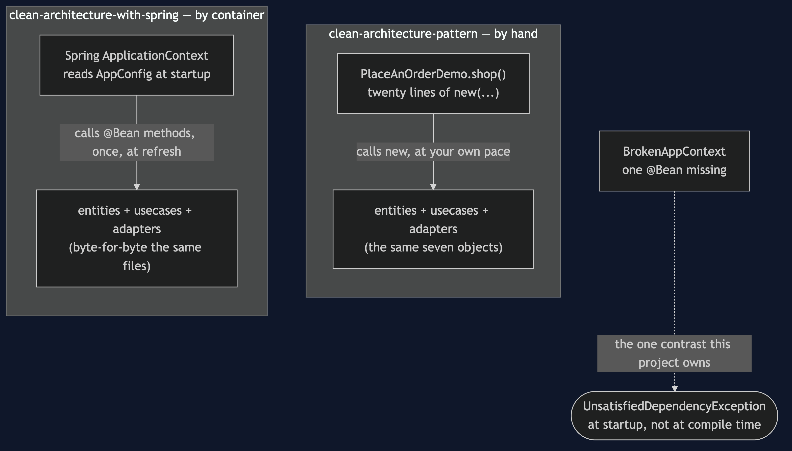
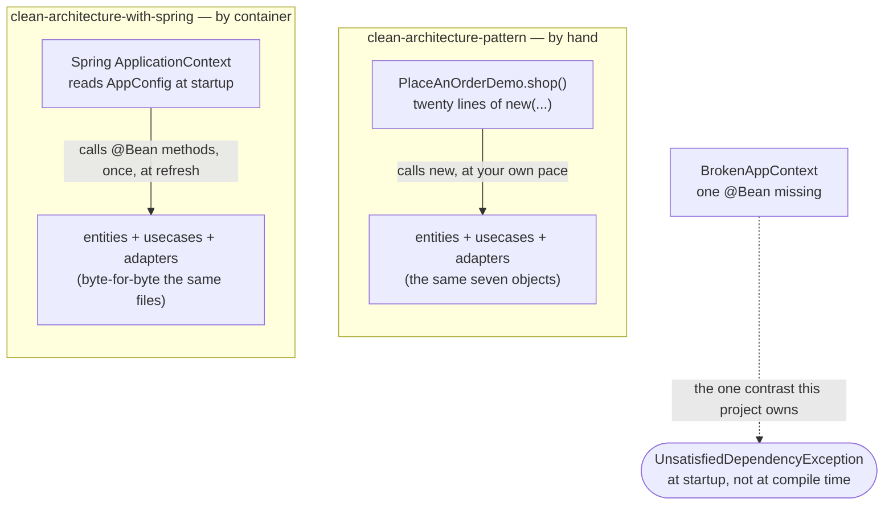

# Clean Architecture with Spring — Architecture Diagram

Two ways of producing the identical graph, side by side. The three inner
circles — entities, use cases, adapters — are the same boxes either way;
only the outermost box, the one that builds them, differs.

Mermaid source

## Reading The Diagram

**The inner boxes are identical, and labelled as such.** This diagram does
not repeat what is inside them — see the hand-wired project's own
architecture diagram for that.

**Only the outer box changed shape.** `PlaceAnOrderDemo.shop()` is a method
a person wrote and reads top to bottom. `AppConfig`, read by a container,
is discovered and invoked in whatever order satisfies its own dependencies
— which is exactly the freedom that lets a missing bean go unnoticed until
something actually asks for it.
