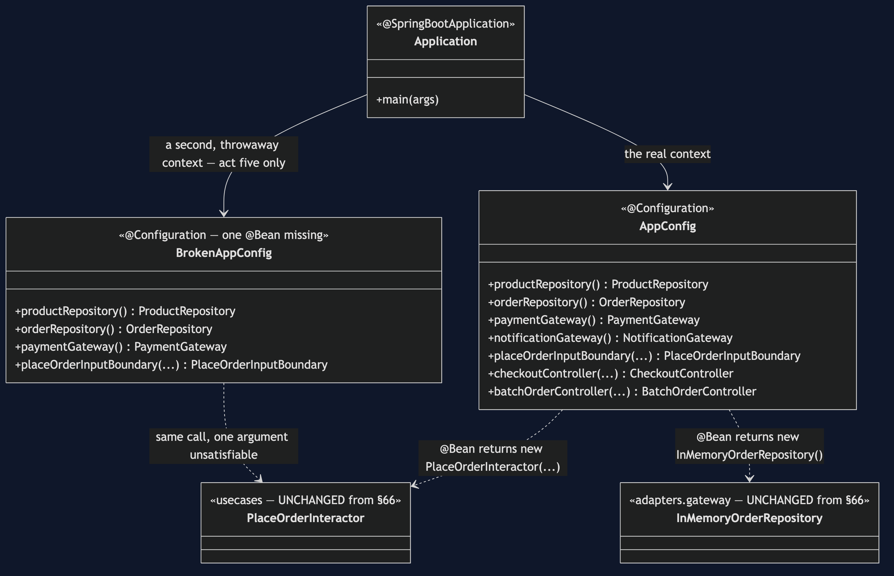
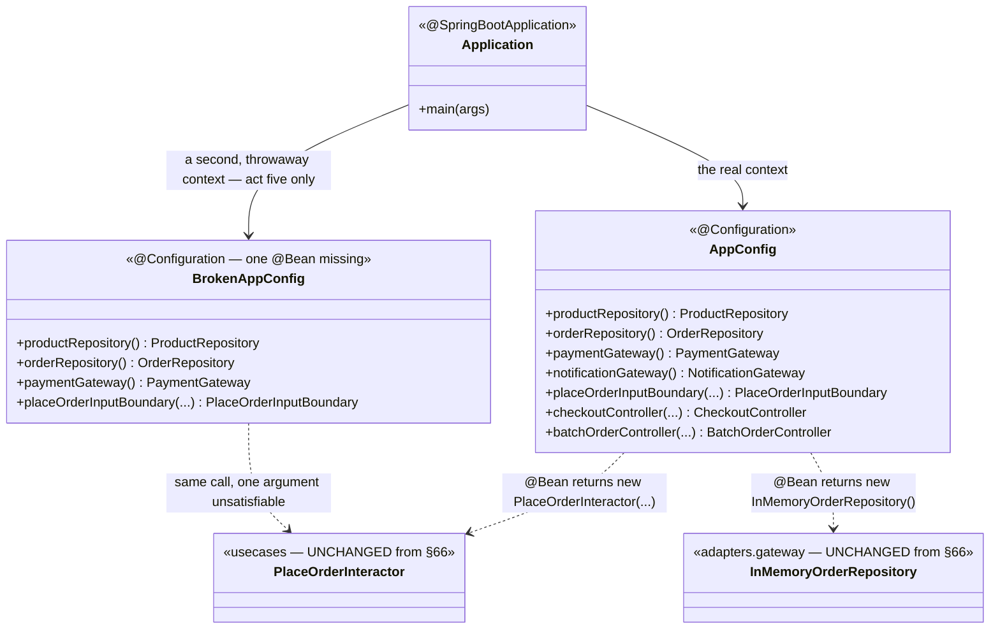

# Clean Architecture with Spring — Class Diagram

This project adds exactly three classes to `clean-architecture-pattern`'s
unchanged graph: `AppConfig`, `BrokenAppConfig`, and `Application`. For the
graph itself — entities, use cases, adapters — see
[`../../clean-architecture-pattern/docs/class-diagram.md`](../../clean-architecture-pattern/docs/class-diagram.md);
every class on that diagram exists here too, byte-for-byte.

Mermaid source

## Reading The Diagram

**`AppConfig` and `BrokenAppConfig` both return the identical
`new PlaceOrderInteractor(...)` call.** The classes on the right — every
entity, use case and adapter — do not know, and could not tell you,
whether they were constructed by a person or a container.

**`Application` depends on both configuration classes, but never at the
same time.** `AppConfig` builds the context every other act uses;
`BrokenAppConfig` is only ever built as its own separate, short-lived
context, in act five, specifically to fail.
