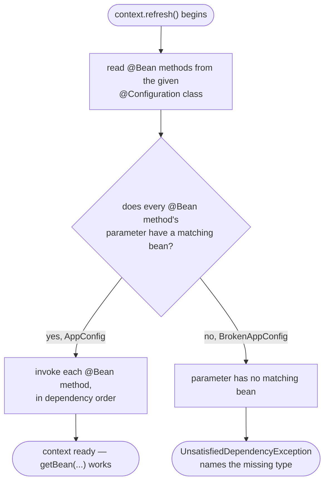

# Clean Architecture with Spring — Data Flow Diagram

Not an order this time — a **bean**, flowing from a `@Configuration` class
through context refresh to either a working object graph or a startup
failure.

Mermaid source

## Reading The Diagram

**One flowchart, two configuration classes, two different endpoints.**
`AppConfig` and `BrokenAppConfig` enter this diagram at exactly the same
node — nothing distinguishes them until the resolution check partway
through.

**The failure is discovered, not declared.** There is no node on this
diagram where `BrokenAppConfig` is inspected and rejected before startup —
the missing bean is only found when the container actually tries to
satisfy it, which is why the failure surfaces at `refresh()`, seconds into
what otherwise looks like an ordinary run, rather than the moment the file
was saved.
