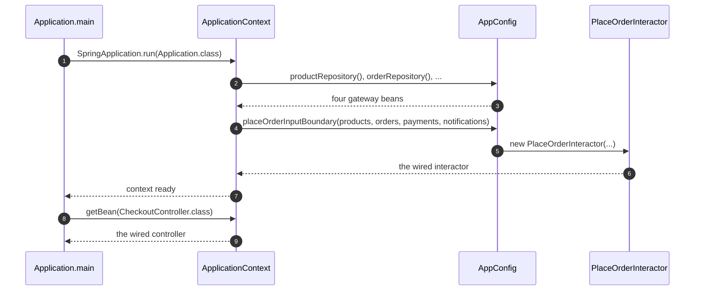

# Clean Architecture with Spring — Sequence Diagram

Written for a listener with the screen off: what actually happens, in
order, when this project starts.

Say it in words. The application asks Spring to build a context from one
configuration class. Spring reads every method on that class marked as
producing a bean, works out which ones depend on which others by matching
parameter types to return types, and calls each method exactly once, in
whatever order satisfies those dependencies. Once every method has run,
the context is ready, and asking it for a checkout controller, or for the
use case's own input boundary, returns the fully wired object — the same
object the hand-wired project's `main` method would have built by calling
four constructors itself.

Mermaid source

Say the load-bearing sentence aloud: **every bean method runs once, at
startup, in dependency order that Spring works out — not in the order
written in the file, and not at the moment a person decided to call it.**
That is the whole difference from the hand-wired project, where every
`new` call runs exactly when the line it is written on executes.

For the failing sequence — the same shape, with one bean missing — see
[`uml-diagram.md`](uml-diagram.md).
