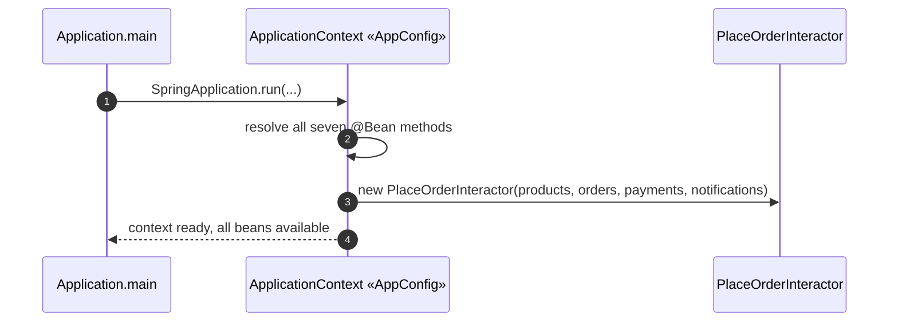
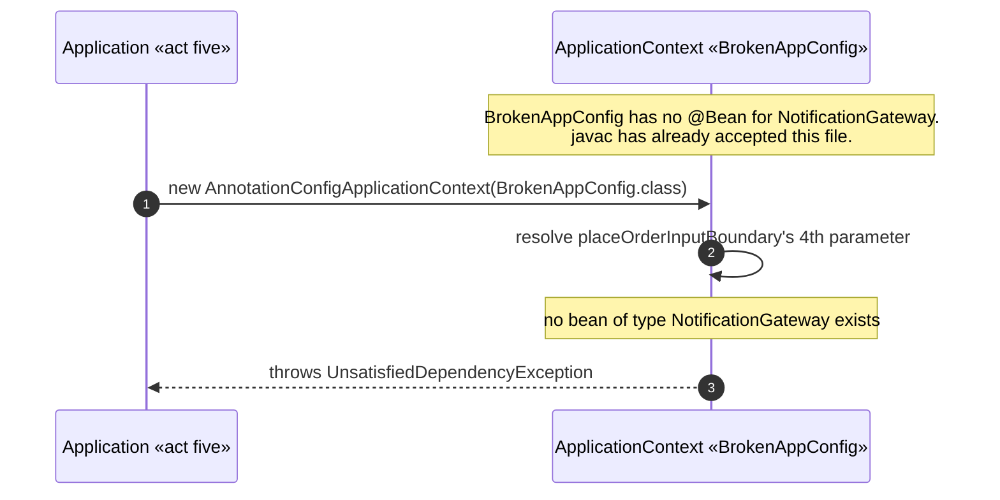

# Clean Architecture with Spring — UML Sequence Diagrams

Two sequences: the container succeeding, and the container failing on the
identical mistake that would not compile in the hand-wired project.

## 1. The Container Wires The Whole Graph

Mermaid source

## 2. The Container Fails — At Startup, Not At Compile Time

Mermaid source

Compare sequence two with deleting the equivalent argument from
`clean-architecture-pattern`'s hand-wired `new PlaceOrderInteractor(...)`
call: that failure happens in your editor, at the moment you try to save
the file, and never reaches a running process at all.
