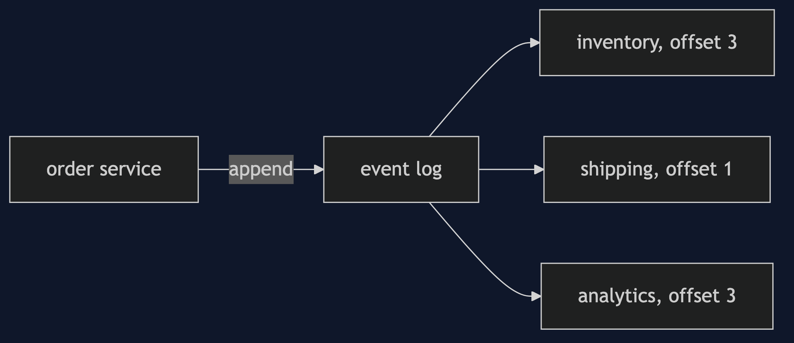

# Event-Driven Architecture Pattern

```
src/main/java/com/jk/explore/eda/
├── EdaDemo.java                     the six acts
├── EventLog.java                    an append-only list of events
├── Event.java
├── OrderService.java                only appends
├── Reactor.java                     reads at its own position; can be down
├── Warehouse.java                   stock, changed by a reactor
│
└── DirectShop.java                  the version that calls and waits
```

**Event-driven architecture: services write facts to a log and read it at their own pace, and never call each other.**

This project is in [architectural-design-patterns](..). It is the whole-system version of [Publisher-Subscriber](../../micro-services-design-patterns/publisher-subscriber-pattern) and [Event Bus](../../messaging-integration-patterns/event-bus-pattern), and the base that [Domain Event](../../domain-driven-design-patterns/domain-event-pattern) is a part of.

## Run

```bash
./gradlew run
```

Six acts. Every number quoted below comes from this program's own output.

```
ONE. Calling each other.
  the order service calls shipping and waits. shipping is down. order accepted: false. orders placed: 0.
  a customer lost an order because a service they never see was down.
TWO. Telling the log.
  the order service appended the event at offset 0 and finished. it has no reference to inventory or shipping.
  [inventory reserved ORD-1, shipping planned ORD-1].
THREE. A service that is down.
  shipping is down. three orders were accepted anyway. shipping planned [], and is 3 events behind.
  shipping came back and caught up: planned [ORD-1, ORD-2, ORD-3], 0 behind.
FOUR. A new reader, and no change to the writer.
  analytics was added after two orders. it read the log from the start: [ORD-1, ORD-2].
  the order service was not touched. the log is kept, so a new service can be built from history.
FIVE. Not the same instant.
  the order is accepted. stock in the warehouse: 10. it should be 9.
  after inventory reads the log: 9.
  for a moment the two disagree. the system is eventually consistent, not consistent at every instant.
SIX. The bill.
  the same event delivered twice. stock: without a duplicate check 8, with one 9. it should be 9.
  and the flow of an order is now spread over several services, each reading the log: to see it, you read the log, not one piece of code.
```

## Test

```bash
./gradlew test
```

2 test classes, 7 test methods, offline, with nothing installed and no framework.

## Technologies and versions

| What | Version | Why it is here |
| --- | --- | --- |
| Java | 21 | The repository standard, via the Gradle toolchain block |
| Gradle | 9.2.1 | The wrapper in this directory; no separate install needed |
| JUnit 5 | 5.10.2 | Test runner |

No framework. A hand-built project stays plain Java so the mechanism is the whole lesson.

## Learning Material

| Document | What it covers |
| --- | --- |
| [`docs/problem-statement.md`](docs/problem-statement.md) | The scenario, and the problem |
| [`docs/event-driven-architecture-pattern-explained.md`](docs/event-driven-architecture-pattern-explained.md) | The pattern, and six acts |
| [`docs/class-diagram.md`](docs/class-diagram.md) | The types |
| [`docs/architecture-diagram.md`](docs/architecture-diagram.md) | The parts and how they connect |
| [`docs/data-flow-diagram.md`](docs/data-flow-diagram.md) | What happens to one request |
| [`docs/sequence-diagram.md`](docs/sequence-diagram.md) | Written for a listener with the screen off |
| [`docs/uml-diagram.md`](docs/uml-diagram.md) | Four sequences |
| [`docs/animation.html`](docs/animation.html) | The six acts in a browser |
| [`docs/prerequisites.md`](docs/prerequisites.md) | What you need to know |
| [`docs/session.md`](docs/session.md) | A one-hour taught session |
| [`docs/spec.md`](docs/spec.md) | The generated specification |
| [`docs/youtube.md`](docs/youtube.md) | Title, description and chapters |

### The pattern in one picture


### Where each piece sits



### How one request moves


### Who calls whom, in order


### All four sequences


### Video

Built from [`video/scenes.py`](video/scenes.py) by
[`video/build_video.sh`](video/build_video.sh). The rendered file is not
committed; see the repository README for why.

## Where you have already met this

Kafka-based systems, Amazon's order pipelines, and the browser, where everything is an event.

## When this is too much

For a small system where all parts are always up together, a direct call is simpler and easier to follow. Events pay off when parts fail or change on their own.

## Where this sits

This project is in [`architectural-design-patterns`](..), and is meant to be read with its neighbours there.
