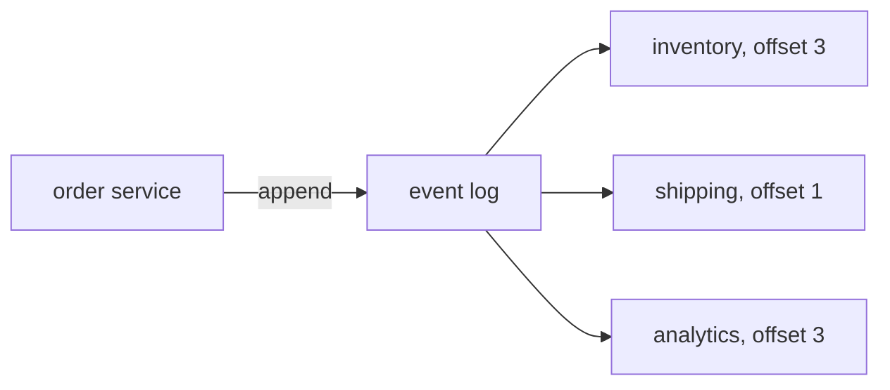

# Event-Driven Architecture Pattern — Architecture Diagram

One writer, one log, and readers that do not know each other.

Mermaid source

```mermaid
flowchart LR
    O["order service"] -->|append| L["event log"]
    L --> I["inventory, offset 3"]
    L --> S["shipping, offset 1"]
    L --> A["analytics, offset 3"]
```

