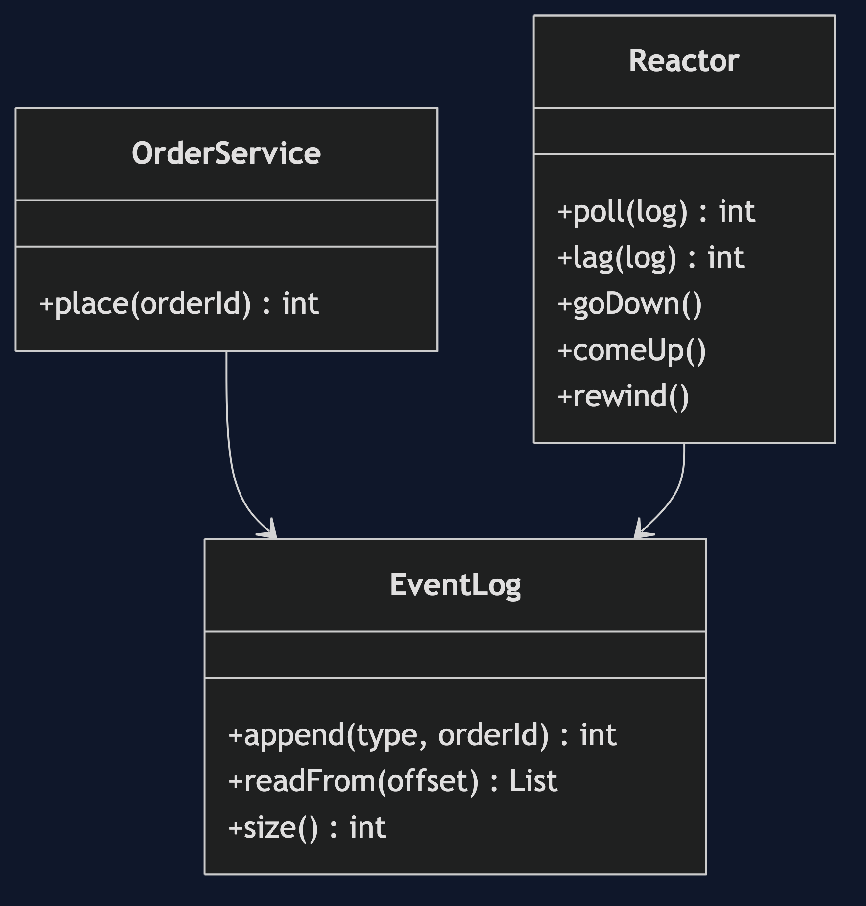
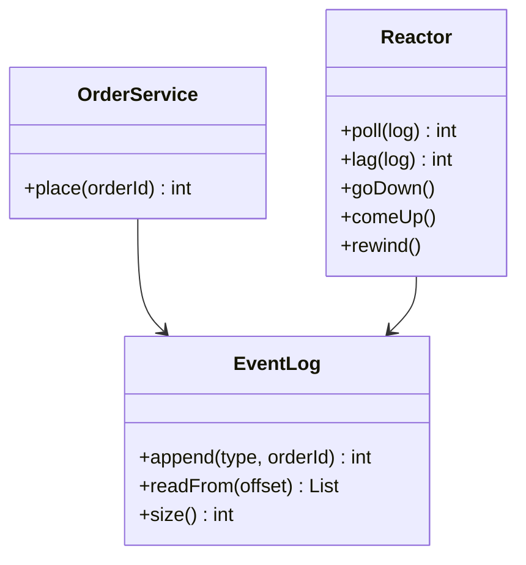

# Event-Driven Architecture Pattern — Class Diagram

A log, a writer that appends, and readers with a position.

Mermaid source

```mermaid
classDiagram
    class EventLog {
        +append(type, orderId) int
        +readFrom(offset) List
        +size() int
    }
    class OrderService {
        +place(orderId) int
    }
    class Reactor {
        +poll(log) int
        +lag(log) int
        +goDown()
        +comeUp()
        +rewind()
    }
    OrderService --> EventLog
    Reactor --> EventLog
```

