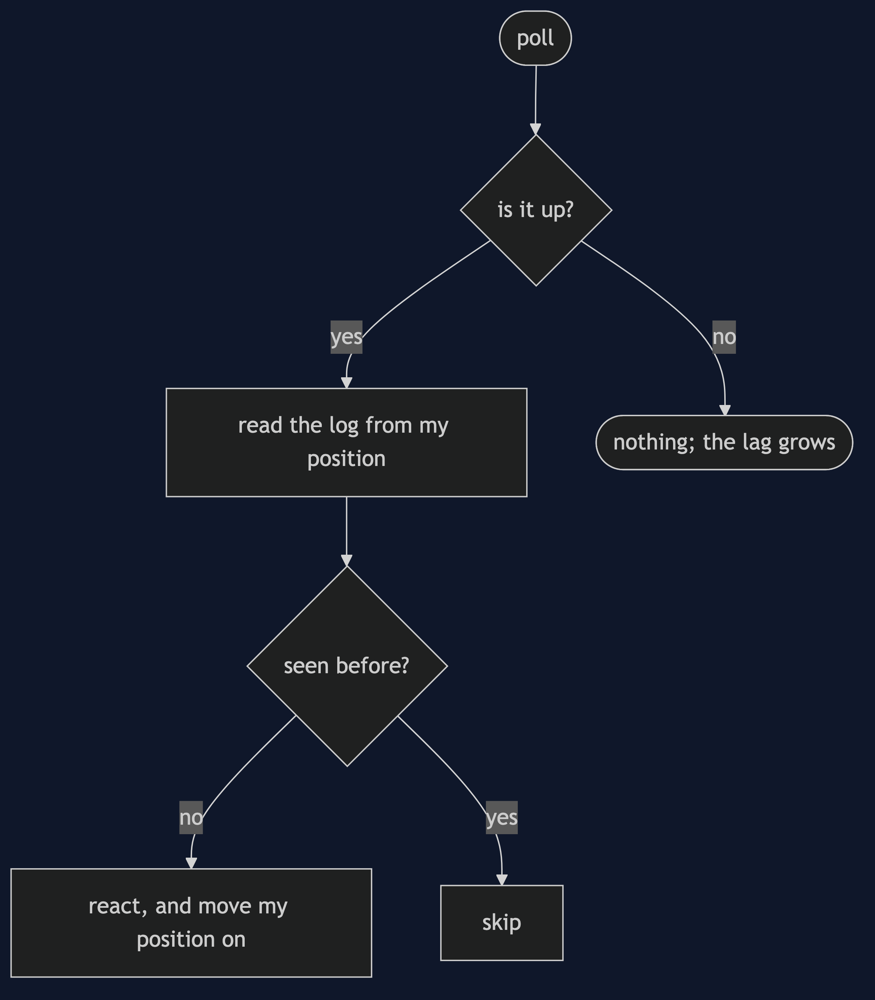
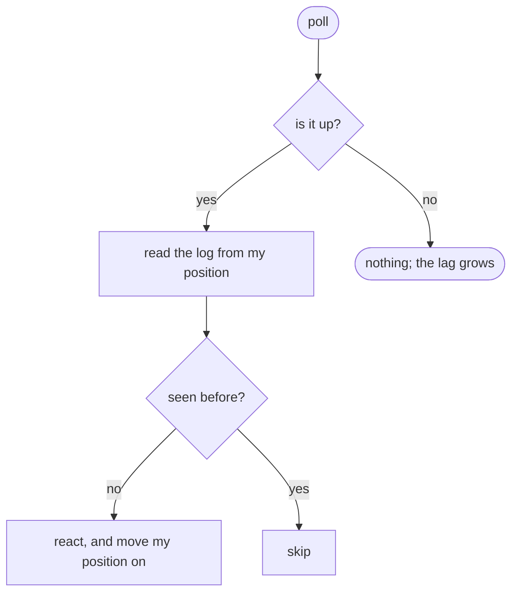

# Event-Driven Architecture Pattern — Data Flow Diagram

What a reader does when it polls.

Mermaid source

```mermaid
flowchart TD
    Poll(["poll"])
    Up{"is it up?"}
    Read["read the log from my position"]
    Seen{"seen before?"}
    Do["react, and move my position on"]
    Skip["skip"]
    Poll --> Up
    Up -- no --> Nothing(["nothing; the lag grows"])
    Up -- yes --> Read --> Seen
    Seen -- no --> Do
    Seen -- yes --> Skip
```

