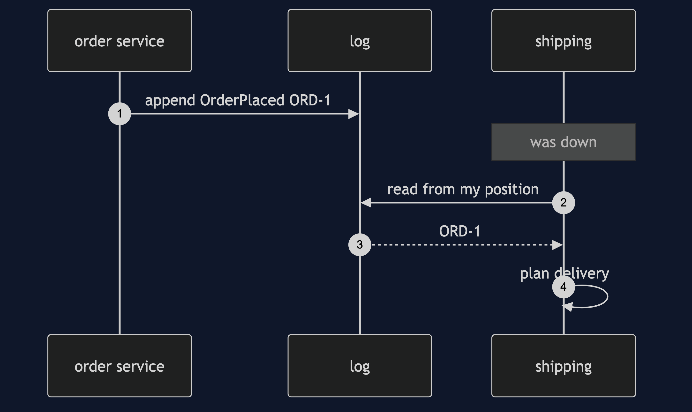
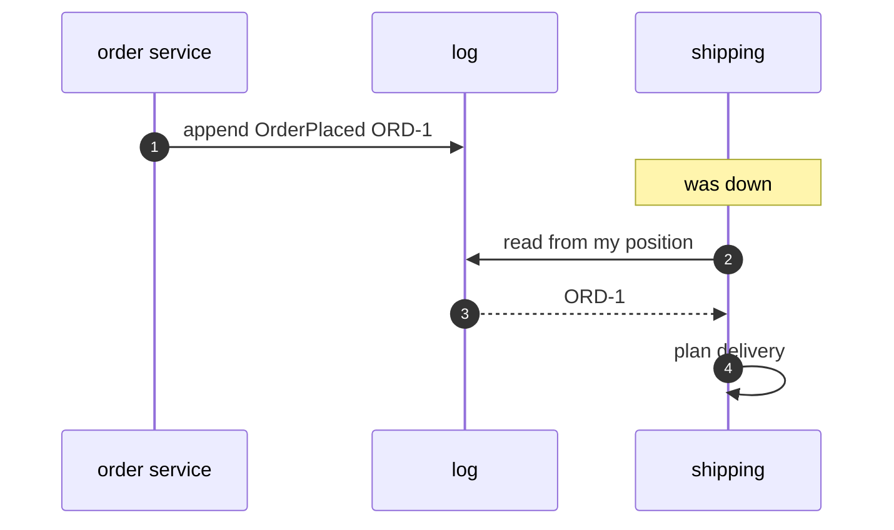

# Event-Driven Architecture Pattern — Sequence Diagram

Written for a listener with the screen off.

Say it in words. The order service appends an order placed event to the log, and it is done. Later, shipping, which was down, comes back. It reads the log from its position, gets three events, and plans each. Inventory, which was up, read the first one long ago. Nobody called anybody.

Mermaid source

The load-bearing sentence: **the writer never calls a reader.**
