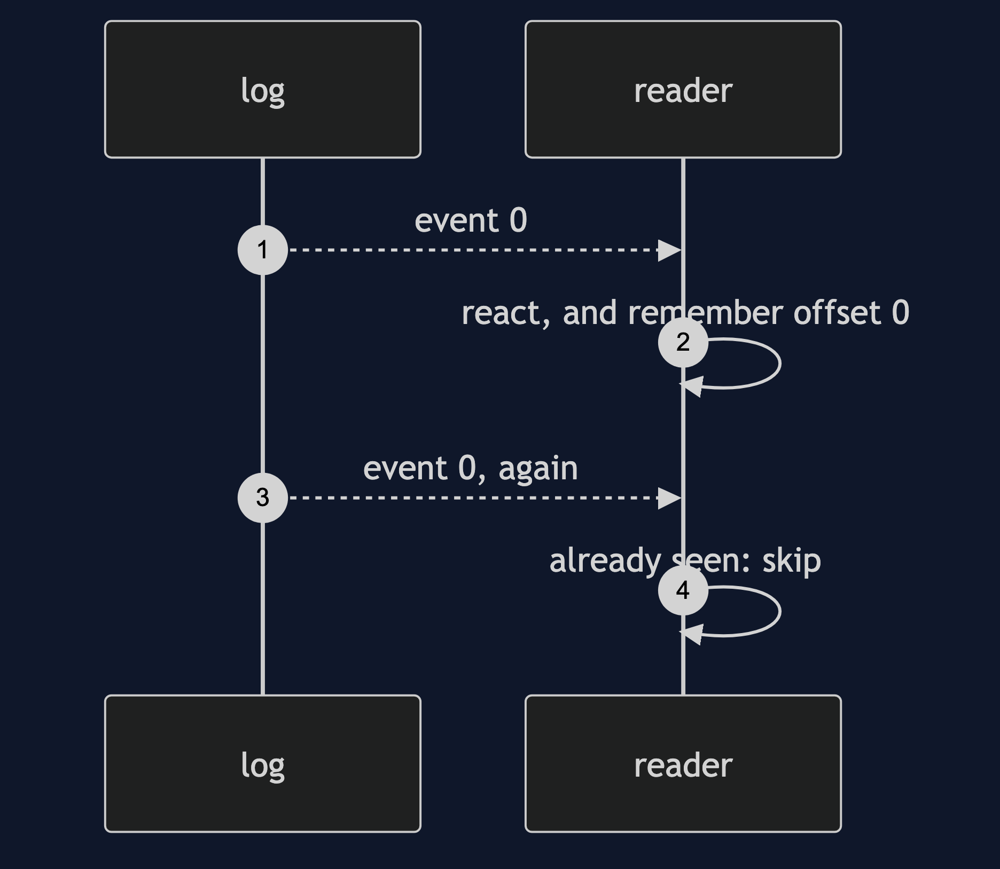
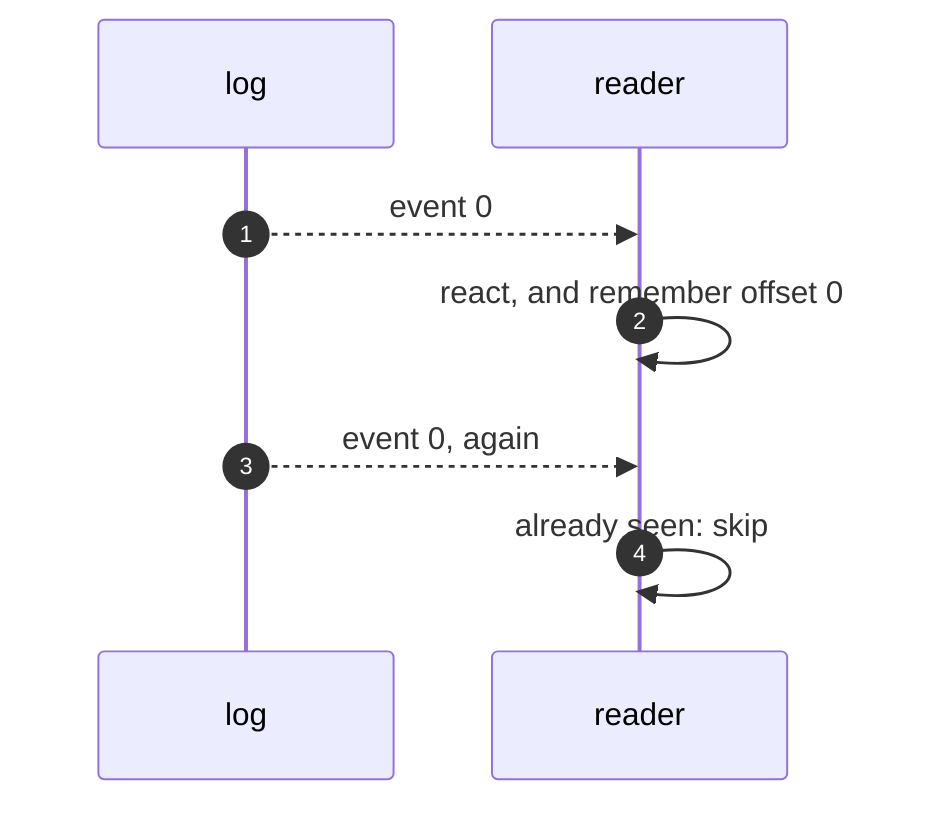

# Event-Driven Architecture Pattern — UML Sequence Diagrams

Four sequences.

## 1. A Duplicate

Mermaid source

```mermaid
sequenceDiagram
    autonumber
    participant L as log
    participant R as reader
    L-->>R: event 0
    R->>R: react, and remember offset 0
    L-->>R: event 0, again
    R->>R: already seen: skip
```

