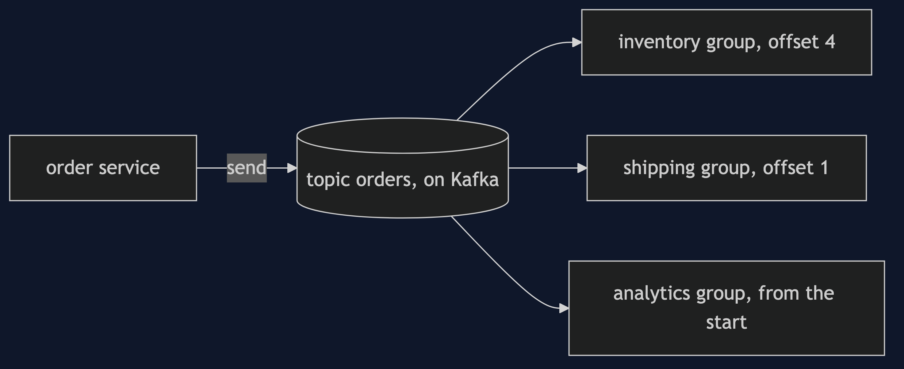
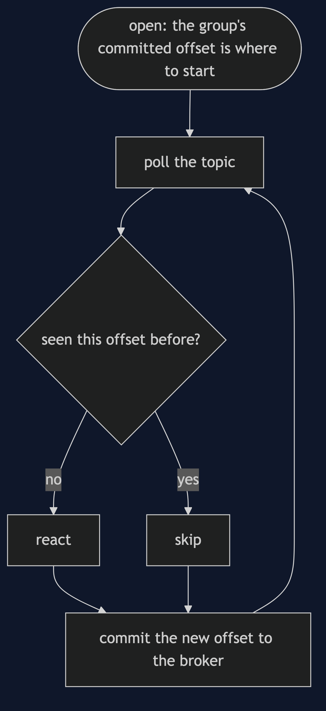

# Event-Driven Architecture with Kafka Pattern

```
src/main/java/com/jk/explore/edakafka/
├── KafkaEdaDemo.java            the six acts
├── Broker.java                  runs the Kafka container; makes topics
├── OrderService.java            a producer: sends events, and does not know the readers
├── Reader.java                  a consumer group: commits its offset; can be closed and reopened
├── Warehouse.java               stock, changed by a reader
│
└── DirectShop.java              the version that calls and waits
```

**With Kafka, the log is a topic, each service is a consumer group, and the broker remembers how far each has read.**

This project is the framework version of [Event-Driven Architecture](../event-driven-architecture-pattern). That project built the mechanism by hand. This one shows the same idea inside Apache Kafka. It does not re-teach the pattern. It shows what Apache Kafka adds, the failures that are its own, and what it costs.

## Run

```bash
./gradlew run
```

Six acts. The partner project, Event-Driven Architecture, built the mechanism by hand. Here the same idea runs through Apache Kafka, and every count comes from real output.

```
ONE. Calling and waiting.
  the order service calls shipping and waits. shipping is down. order accepted: false. orders placed: 0.
  a customer lost an order because a service they never see was down.
TWO. Telling the log.
  the order service sent the event to Kafka, which gave it offset 0, and finished. it has no reference to inventory or shipping.
  [inventory saw OrderPlaced ORD-1, shipping saw OrderPlaced ORD-1].
THREE. A service that is down.
  shipping read ORD-1 and then went down. three more orders were accepted. shipping is 3 events behind, as the broker counts it.
  shipping came back and caught up, from where it stopped. it has now planned 4 orders, and is 0 behind.
FOUR. A new reader, and no change to the writer.
  analytics was added after two orders. it read the topic from the start: [OrderPlaced ORD-1, OrderPlaced ORD-2].
  the order service was not touched. Kafka keeps the events, so a new service can be built from history.
FIVE. Not the same instant.
  the order is accepted. stock in the warehouse: 10. it should be 9.
  after inventory reads the topic: 9.
  for a moment the two disagree. the system is eventually consistent, not consistent at every instant.
SIX. The bill.
  the same event delivered twice, as Kafka may after a missed commit. stock: without a duplicate check 8, with one 9. it should be 9.
  and the flow of an order is now spread over several services, each reading the topic: to see it, you read the topic, not one piece of code.
  and a broker is another system to run: this demo needed 1 container for 1 topic.
```

## Test

```bash
./gradlew test
```

2 test classes, 4 test methods, offline, with each Spring context started inside the test, and no server.

## Technologies and versions

| What | Version | Why it is here |
| --- | --- | --- |
| Java | 21 | The repository standard, via the Gradle toolchain block |
| Gradle | 9.2.1 | The wrapper in this directory |
| Docker | 24+ | Runs the broker |
| Apache Kafka | 4.3.1 | The broker, in a container, and the client library |
| slf4j-simple | 2.0.16 | The client's logging |
| JUnit 5 | 5.10.2 | Test runner; the Kafka test is skipped when Docker is missing |

See [`docs/dependencies.md`](docs/dependencies.md).

## Learning Material

| Document | What it covers |
| --- | --- |
| [`docs/problem-statement.md`](docs/problem-statement.md) | The partner's log, and what is new |
| [`docs/event-driven-architecture-with-kafka-pattern-explained.md`](docs/event-driven-architecture-with-kafka-pattern-explained.md) | A real broker, real offsets and lag |
| [`docs/class-diagram.md`](docs/class-diagram.md) | The types |
| [`docs/architecture-diagram.md`](docs/architecture-diagram.md) | An order service, Kafka and its readers |
| [`docs/data-flow-diagram.md`](docs/data-flow-diagram.md) | How a reader catches up |
| [`docs/sequence-diagram.md`](docs/sequence-diagram.md) | Written for a listener with the screen off |
| [`docs/uml-diagram.md`](docs/uml-diagram.md) | Four sequences |
| [`docs/animation.html`](docs/animation.html) | The six acts in a browser |
| [`docs/prerequisites.md`](docs/prerequisites.md) | What you need to know |
| [`docs/session.md`](docs/session.md) | A one-hour taught session |
| [`docs/spec.md`](docs/spec.md) | The generated specification |
| [`docs/youtube.md`](docs/youtube.md) | Title, description and chapters |
| [`docs/dependencies.md`](docs/dependencies.md) | What Apache Kafka is, what it costs, and that skipping this project loses none of the pattern |

### The pattern in one picture


### Where each piece sits



### How one request moves



### Who calls whom, in order


### All four sequences


### Video

Built from [`video/scenes.py`](video/scenes.py) by
[`video/build_video.sh`](video/build_video.sh). The rendered file is not
committed; see the repository README for why.

## Where you have already met this

Most large event-driven systems: order pipelines, activity feeds and change data capture.

## When this is too much

For a small system where all parts are always up together, a direct call is simpler. A broker is a system to run, and to understand.

## Where this sits

This project pairs with [Event-Driven Architecture](../event-driven-architecture-pattern), and is a framework version in [`architectural-design-patterns`](..).
