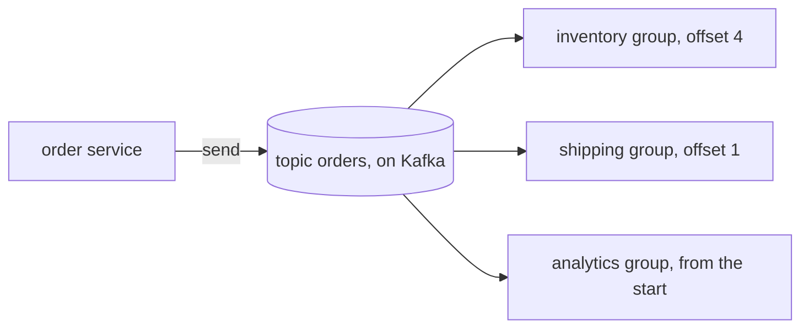

# Event-Driven Architecture with Kafka Pattern — Architecture Diagram

One writer, one topic, and readers that do not know each other.

Mermaid source

```mermaid
flowchart LR
    O["order service"] -->|send| T[("topic orders, on Kafka")]
    T --> I["inventory group, offset 4"]
    T --> S["shipping group, offset 1"]
    T --> A["analytics group, from the start"]
```

