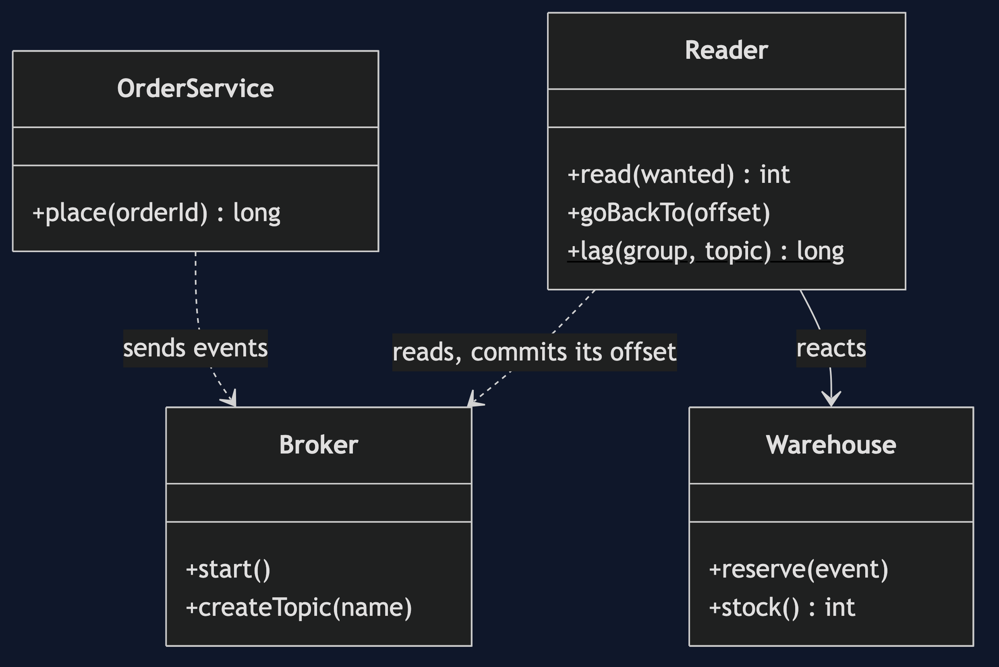
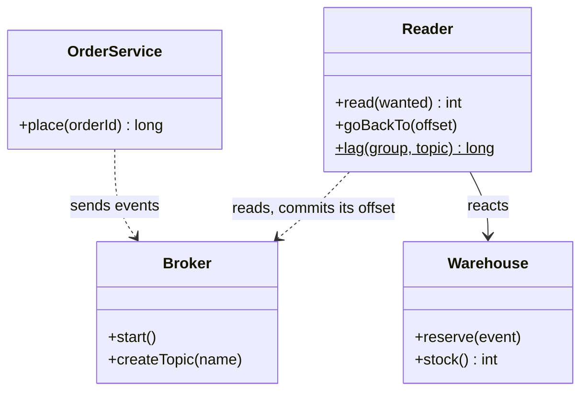

# Event-Driven Architecture with Kafka Pattern — Class Diagram

A broker in a container, a producer, and readers that are consumer groups.

Mermaid source

```mermaid
classDiagram
    class Broker {
        +start()
        +createTopic(name)
    }
    class OrderService {
        +place(orderId) long
    }
    class Reader {
        +read(wanted) int
        +goBackTo(offset)
        +lag(group, topic)$ long
    }
    class Warehouse {
        +reserve(event)
        +stock() int
    }
    OrderService ..> Broker : sends events
    Reader ..> Broker : reads, commits its offset
    Reader --> Warehouse : reacts
```

