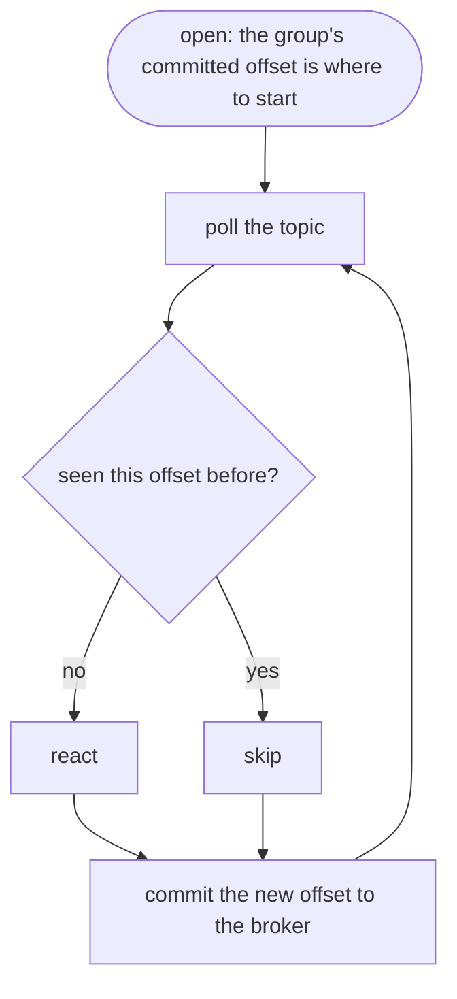

# Event-Driven Architecture with Kafka Pattern — Data Flow Diagram

What a reader does.

Mermaid source

```mermaid
flowchart TD
    Open(["open: the group's committed offset is where to start"])
    Poll["poll the topic"]
    Seen{"seen this offset before?"}
    Do["react"]
    Skip["skip"]
    Commit["commit the new offset to the broker"]
    Open --> Poll --> Seen
    Seen -- no --> Do --> Commit
    Seen -- yes --> Skip --> Commit
    Commit --> Poll
```

