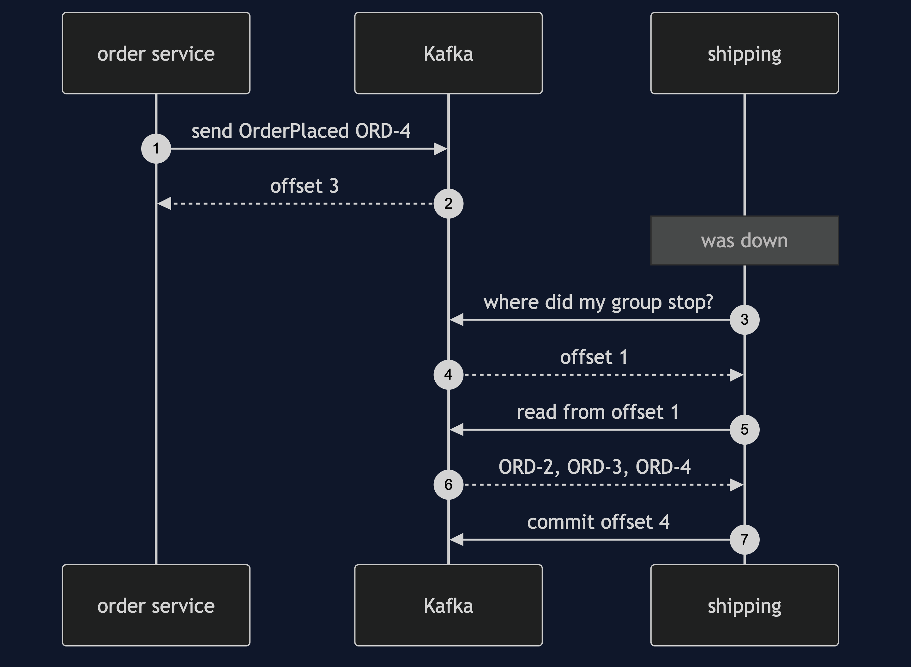

# Event-Driven Architecture with Kafka Pattern — Sequence Diagram

Written for a listener with the screen off.

Say it in words. The order service sends an order placed event to Kafka, and Kafka replies with offset three. That is all the order service does. Shipping, which was down, starts, and asks Kafka where its group left off. Kafka says offset one. Shipping reads offsets one to three, plans each, and commits offset four. Nobody called anybody.

The load-bearing sentence: **the writer never calls a reader, and the broker remembers each group.**
