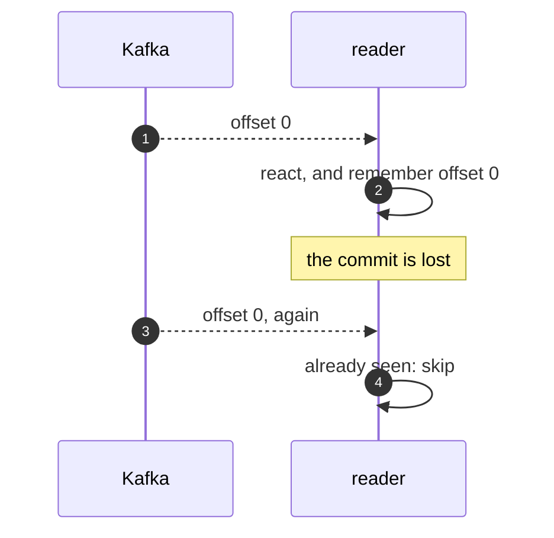

# Event-Driven Architecture with Kafka Pattern — UML Sequence Diagrams

Four sequences.

## 1. A Redelivery

Mermaid source

```mermaid
sequenceDiagram
    autonumber
    participant K as Kafka
    participant R as reader
    K-->>R: offset 0
    R->>R: react, and remember offset 0
    Note over R: the commit is lost
    K-->>R: offset 0, again
    R->>R: already seen: skip
```

