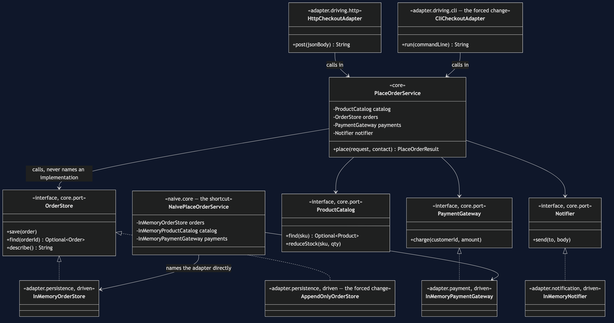
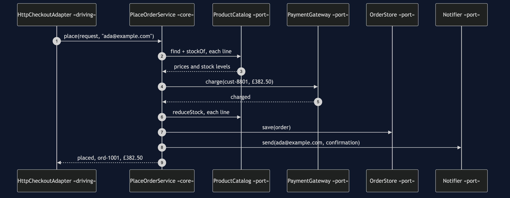
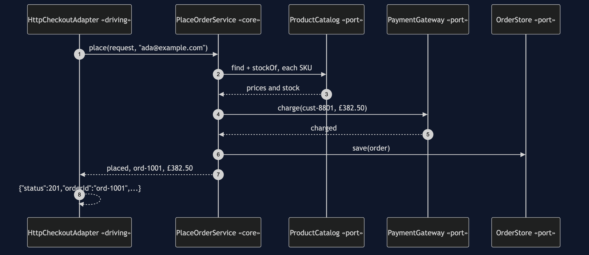
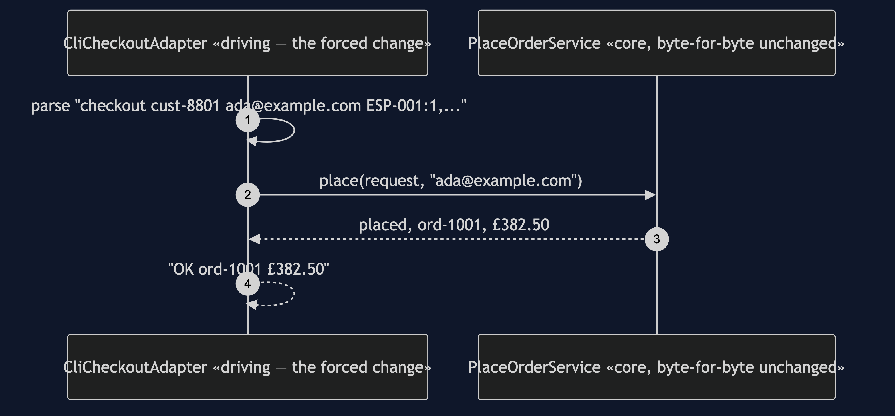
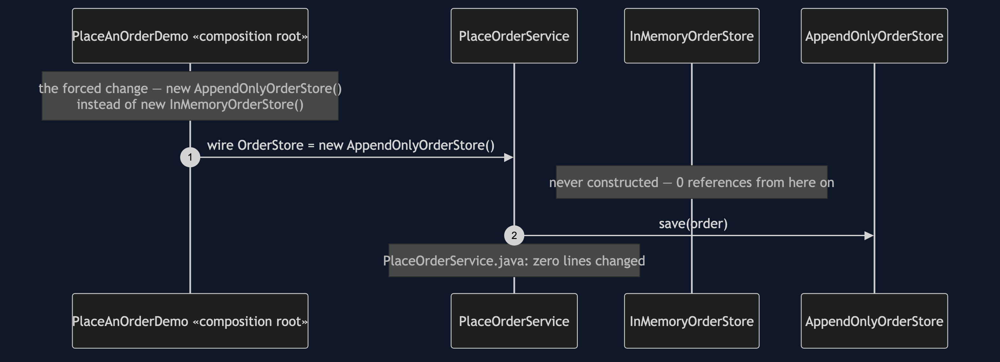
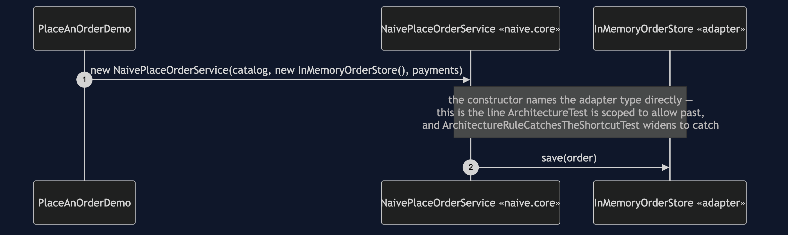

# Hexagonal Architecture Pattern

```
src/main/java/com/jk/explore/hexagonal/
├── PlaceAnOrderDemo.java          composition root — the five acts
├── ForcedChange.java              counts the bill, from real files on disk
│
├── core/                          ← depends on nothing outside itself
│   ├── PlaceOrderService.java      the use case — imports only domain + port
│   ├── PlaceOrderRequest.java · PlaceOrderResult.java
│   ├── domain/                     Order, OrderLine, Money, Product...
│   └── port/                       ← interfaces, declared BY the core
│       ├── OrderStore.java · ProductCatalog.java
│       └── PaymentGateway.java · Notifier.java
│
├── adapter/                       ← reaches UP to the core, never the reverse
│   ├── persistence/
│   │   ├── InMemoryOrderStore.java
│   │   ├── AppendOnlyOrderStore.java    the driven-side forced change
│   │   └── InMemoryProductCatalog.java
│   ├── payment/InMemoryPaymentGateway.java
│   ├── notification/InMemoryNotifier.java
│   └── driving/
│       ├── http/HttpCheckoutAdapter.java
│       └── cli/CliCheckoutAdapter.java   the driving-side forced change
│
└── naive/core/                    ← kept on purpose, outside the real core
    └── NaivePlaceOrderService.java       the shortcut — names adapters directly
```

`src/test/java/.../hexagonal/ArchitectureTest.java` is what checks the one
rule that matters: no class in `core` may depend on any class in `adapter`,
in either direction.

**The core defines ports — interfaces, in its own language, for whatever it
needs from the outside world. Adapters, outside the core, implement those
ports or call through them, so every dependency between the core and the
world points inward.**

This is project 65 of [architectural-design-patterns](..), one step from
[Layered Architecture](../layered-architecture-pattern): the same feature,
with the one thing that project's own documents admitted it had not
fixed — the use case naming its storage by import — inverted here.

## Run

```bash
./gradlew run
```

Five acts.

```
TWO. The real core, driven by HTTP.
  {"status":201,"orderId":"ord-1001","total":"£382.50"}
  the core has two imports: core.domain and core.port.
  it does not know HTTP, or any adapter, exists.

FOUR. The driving side swapped — a CLI calls in.
  $ OK  ord-1001  £382.50
  the same PlaceOrderService instance shape, called from
  a shape as different from HTTP as this project has.
```

```
FIVE. The rule, and the bill.
  ...
  FORCED CHANGE: swap storage, AND swap who calls in
    a map  ->  an append-only log        (driven side)
    HTTP   ->  a command line             (driving side)

    files added     : 2   adapter/persistence/AppendOnlyOrderStore.java, adapter/driving/cli/CliCheckoutAdapter.java
    files modified  : 1   PlaceAnOrderDemo.java (the composition root)
    lines changed   : 4
    classes in the core : 14
    of those, opened    : 0
    of those, never opened : 14

  AND THE ONE THAT TOOK THE SHORTCUT
    naive/core/NaivePlaceOrderService.java imports InMemoryOrderStore,
    InMemoryProductCatalog and InMemoryPaymentGateway directly
    swap any one of them, and this class has to be edited too
```

And the acceptance line every project in this category prints identically:

```
ACCEPTANCE
  order ord-1001 for cust-8801: PLACED, 3 lines, £382.50
  stock ESP-001 3, GRD-014 1, BNS-220 38
  charged cust-8801 £382.50 once
  sent 1 confirmation to ada@example.com
  refused: not enough stock, unknown product, payment declined
```

## Test

```bash
./gradlew test
```

Seventeen tests. Two assert the dependency rule on the real core; one
widens it to `naive.core` and asserts the failure names
`NaivePlaceOrderService`. `BothSidesAgreeTest` is the one worth reading
first — it proves, not merely narrates, both halves of this project's
claim: the same core answers identically whether called through
`HttpCheckoutAdapter` or `CliCheckoutAdapter`, and produces the same order
whether saved through `InMemoryOrderStore` or `AppendOnlyOrderStore`.

## Technologies and versions

| What | Version | Why it is here |
| --- | --- | --- |
| Java | 21 | The repository standard |
| Gradle | 9.2.1 | The wrapper in this directory |
| JUnit 5 | 5.10.2 | Test runner |
| ArchUnit | 1.5.0 | Test-only. The core/adapter rule is written and enforced with it |

No Spring, no real HTTP, no real database. Every adapter in this project is
in-memory.

## Learning Material

| Document | What it covers |
| --- | --- |
| [`docs/problem-statement.md`](docs/problem-statement.md) | The naive service, and what it costs |
| [`docs/hexagonal-architecture-pattern-explained.md`](docs/hexagonal-architecture-pattern-explained.md) | Ports, adapters, the one-move difference from Layered, the forced change, the bill |
| [`docs/class-diagram.md`](docs/class-diagram.md) | The types, and which arrows point inward |
| [`docs/architecture-diagram.md`](docs/architecture-diagram.md) | What is allowed to know about what |
| [`docs/data-flow-diagram.md`](docs/data-flow-diagram.md) | One order, entering through either driving adapter |
| [`docs/sequence-diagram.md`](docs/sequence-diagram.md) | Who calls whom — written for a listener with the screen off |
| [`docs/uml-diagram.md`](docs/uml-diagram.md) | Four sequences: HTTP, CLI, the storage swap, the shortcut |
| [`docs/animation.html`](docs/animation.html) | Five steps in a browser |
| [`docs/prerequisites.md`](docs/prerequisites.md) | What you need to know, and what you explicitly do not |
| [`docs/session.md`](docs/session.md) | A one-hour taught session with three exercises |
| [`docs/spec.md`](docs/spec.md) | The generated specification |
| [`docs/youtube.md`](docs/youtube.md) | Title, description and chapters |

### The pattern in one picture

Every arrow out of `PlaceOrderService` lands on a port. `NaivePlaceOrderService`
alone has an arrow to a concrete adapter.



### What is allowed to know about what

Every arrow crossing into the core box points inward — driven adapters
implement a port, driving adapters call the use case.


### How one order enters from either side

Two entry points, one shared path, formatted differently only at the very
last step.


### Who calls whom, in order

The sequence written to work with the screen off: every name the core calls
out is a name the core itself gave.



### All four sequences

The full set from [`docs/uml-diagram.md`](docs/uml-diagram.md).

**One. The core, driven by a simulated HTTP request.**



**Two. The same core, driven by a simulated command line instead.**



**Three. The driven side swapped — storage changes, the core does not.**



**Four. The shortcut — the core's own use case names an adapter.**



### Video

Built from [`video/scenes.py`](video/scenes.py) by
[`video/build_video.sh`](video/build_video.sh). The rendered file is not
committed.

## When this is too much

Worth it when a core genuinely needs to be called from more than one place,
persisted in more than one way, or tested without any real infrastructure
existing yet. Not worth it for an application that will only ever have one
database and one caller — four interfaces that will never have a second
implementation are indirection with nothing behind them but the diagram.

## Where this sits

Project 65 of [`architectural-design-patterns`](..), one step from
[Layered Architecture](../layered-architecture-pattern). The next project,
**Clean Architecture**, generalises exactly this inversion — concentric
layers instead of one core-versus-adapters boundary, with the dependency
rule stated once: source code dependencies point only inward.
