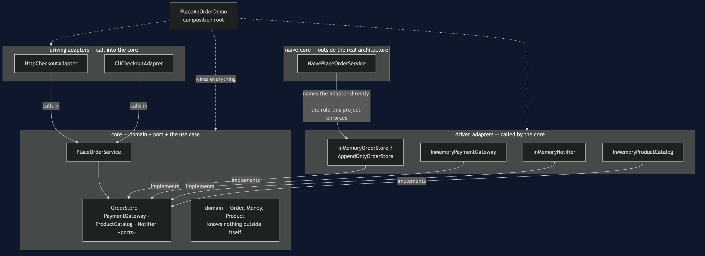
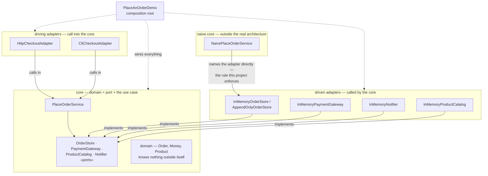

# Hexagonal Architecture Pattern — Architecture Diagram

Read it as one box in the middle — the core — surrounded by adapters on
every side. Every arrow crossing the boundary of the core box points
**inward**. The core has no arrow leaving it for anything outside itself.

Mermaid source

## Reading The Diagram

**Every arrow crossing into the `core` box points inward.** Driven adapters
implement a port; driving adapters call the use case. Neither crossing
originates inside `core` and lands outside it.

**`domain` sits inside `core` with no arrow leaving the box at all.** An
order and a price are true whether or not any adapter, of either kind,
exists.

**The dashed box is not part of the architecture.** `NaivePlaceOrderService`'s
one outward arrow — straight to a concrete adapter — is the line
`ArchitectureRuleCatchesTheShortcutTest` widens the dependency rule to
catch.
