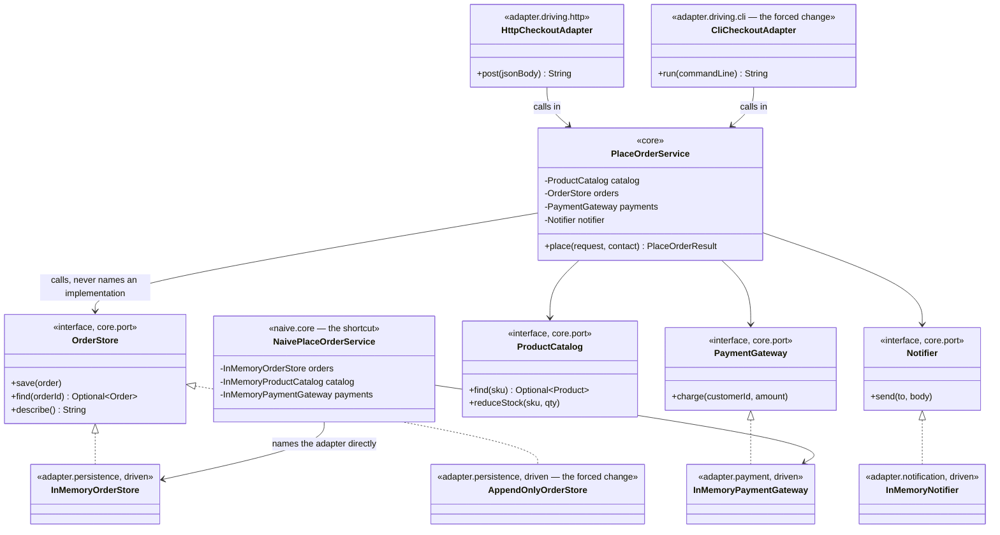

# Hexagonal Architecture Pattern — Class Diagram

The single most important thing on this diagram is which arrows point
**into** the core box and which point **out of** it. Every arrow from
`adapter` lands on an interface in `core.port`. Not one arrow leaves `core`
for `adapter` — except in the dashed naive box, where the direction is
reversed on purpose.

Mermaid source

## Reading The Diagram

**`PlaceOrderService` has four outgoing arrows, and all four land on
interfaces in `core.port`.** Not one lands on `InMemoryOrderStore`,
`InMemoryPaymentGateway`, or any other concrete adapter — it cannot, because
it never imports one.

**Driven adapters point up, at a port, with a hollow triangle — implements,
not extends.** `InMemoryOrderStore` and `AppendOnlyOrderStore` both point at
`OrderStore` and never at each other or at `PlaceOrderService`.

**Driving adapters point at `PlaceOrderService` directly**, and that arrow
is correct — a driving adapter's whole job is to call the core. The
asymmetry is the point: driving adapters may name the core; the core may
never name an adapter, driving or driven.

**`NaivePlaceOrderService` is the only class on this diagram with an arrow
to a concrete adapter from something calling itself a use case.** That
single misdirected arrow is the shortcut `ArchitectureRuleCatchesTheShortcutTest`
exists to catch.
