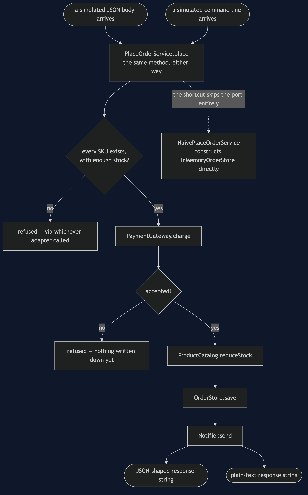
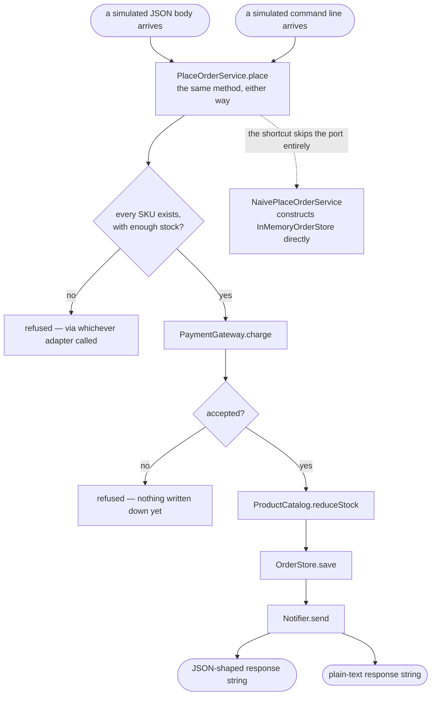

# Hexagonal Architecture Pattern — Data Flow Diagram

One order, entering through either of two driving adapters, flowing through
one unchanged core, and leaving through the ports it declared.

Mermaid source

## Reading The Diagram

**Two arrows enter `Core` from the top, and both go to the same box.**
Whichever driving adapter received the call, `PlaceOrderService.place` runs
identically — there is no branch anywhere in the core asking which adapter
called it, because the core cannot tell.

**Every gate and every write sits inside the one shared path.** A refusal
from either entry point takes the identical route back out, formatted
differently only at the very last step, by the adapter that started the
call.

**The dashed line to `Shortcut` does not pass through any port box.**
`NaivePlaceOrderService` is drawn reaching around the whole diagram to
construct `InMemoryOrderStore` for itself, which is exactly the shortcut
the architecture test exists to catch.
