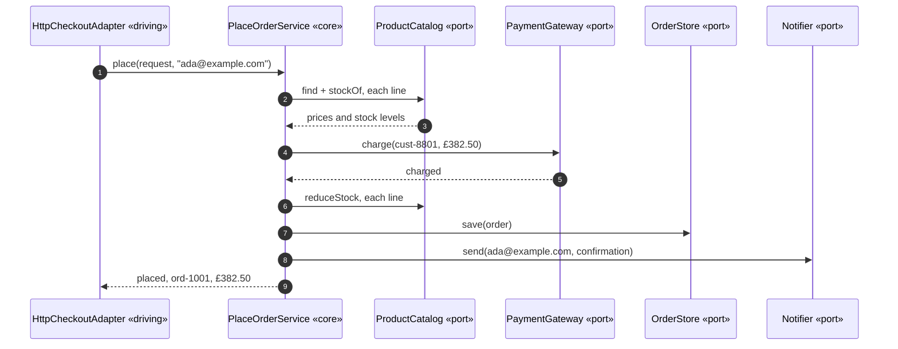

# Hexagonal Architecture Pattern — Sequence Diagram

One order, driven in from outside, in the order the calls actually
happen — written so a listener with the screen off can follow who calls
whom.

Say it in words. An HTTP-shaped adapter receives a request and calls one
method on the core's use case, handing it the order details and nothing
about itself. The core asks its catalogue port for prices and stock, asks
its payment port to take the money, asks its catalogue port again to
reduce stock, asks its storage port to save the order, and asks its
notification port to tell the customer. Every one of those five things the
core asks for is an interface the core itself declared — it does not know,
and cannot find out, which concrete class answered.

Mermaid source

Say the load-bearing sentence aloud, because it is the one a picture cannot
carry on its own: **every name the core calls out in this sequence is a
name the core itself gave.** Not one step names `InMemoryOrderStore`,
`HttpCheckoutAdapter`, or any other concrete class — the core speaks only
in the vocabulary of its own ports.

For the same sequence driven by a command line instead, the driven-side
storage swap, and the naive shortcut, see [`uml-diagram.md`](uml-diagram.md).
