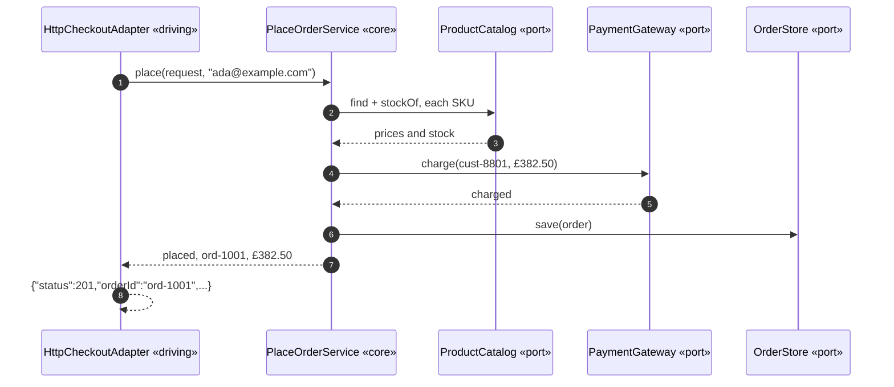
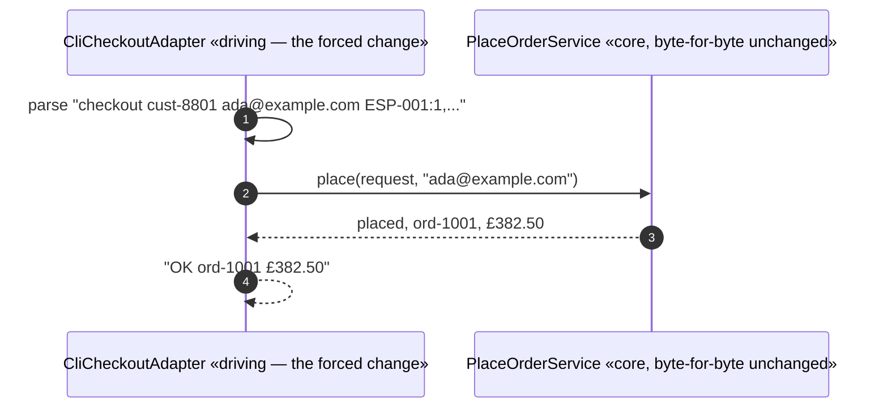
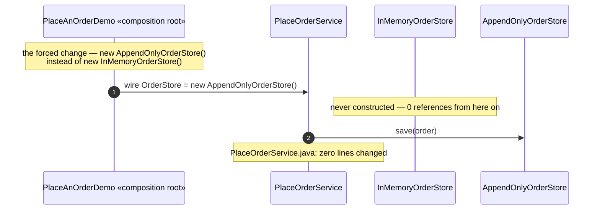
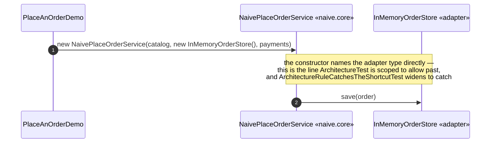

# Hexagonal Architecture Pattern — UML Sequence Diagrams

Four sequences: the core driven by HTTP, the same core driven by a CLI
instead, the driven-side storage swap, and the naive shortcut.

## 1. The Core, Driven By A Simulated HTTP Request

Mermaid source

Every arrow out of `Core` lands on a port, never on `Web`. The adapter
called in; the core never calls back out to it.

## 2. The Same Core, Driven By A Simulated Command Line Instead

Mermaid source

Compare this with sequence 1. `PlaceOrderService` is called with the same
method, the same argument types, from a caller that shares no code with the
first one at all.

## 3. The Driven Side Swapped — Storage Changes, The Core Does Not

Mermaid source

## 4. The Shortcut — The Core's Own Use Case Names An Adapter

Mermaid source

Swap `InMemoryOrderStore` for `AppendOnlyOrderStore` here, and this class
fails to compile — not because its logic is wrong, but because its
constructor named a type instead of an interface.
