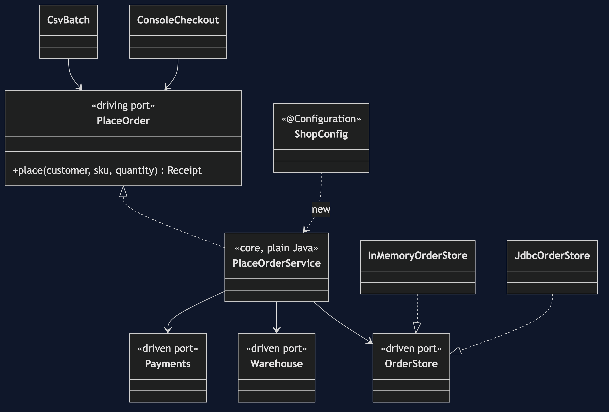
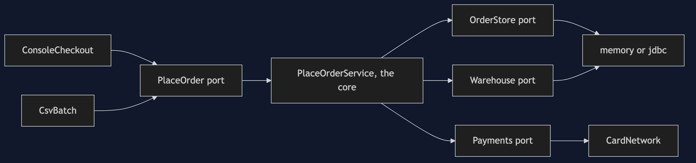
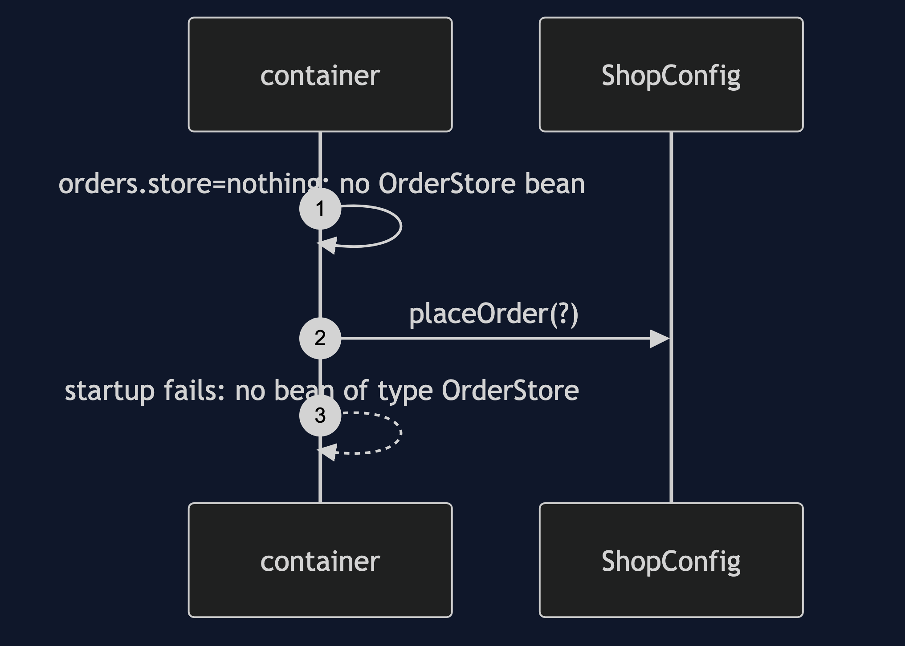

# Hexagonal Architecture with Spring Boot Pattern

```
src/main/java/com/jk/explore/hexagonalspring/
├── ShopApplication.java       the entry point and the six acts
├── HexagonRules.java          the inside rule, in ArchUnit
├── core/                      plain Java: PlaceOrderService, and the ports
│   ├── port/                  OrderStore, Warehouse, Payments, PlaceOrder
│   └── domain/                Order and its exceptions
├── adapter/                   memory, jdbc, CardNetwork, and the two driving adapters
├── config/ShopConfig.java     hands the core its adapters
└── naive/                     SpringyPlaceOrder, never scanned
```

**In Spring Boot the adapters are beans chosen by a property, and the core is a plain class. A rule has to keep it plain.**

This project is the framework version of [Hexagonal Architecture](../hexagonal-architecture-pattern). That project built the mechanism by hand. This one shows the same idea inside Spring Boot. It does not re-teach the pattern. It shows what Spring Boot adds, the failures that are its own, and what it costs.

## Run

```bash
./gradlew run
```

Six acts. The partner project, Hexagonal Architecture, built the mechanism by hand. Here the same idea runs through Spring Boot, and every count comes from real output.

```
ONE. The core is plain Java.
  the use case the container hands out is a PlaceOrderService, not a proxy, in package core.
  classes in the core that mention Spring or an adapter: 0.
TWO. The same use case, two storage adapters.
  orders.store=memory: ORD-000001 for 30000 pence, kept by InMemoryOrderStore, stock now 4.
  orders.store=jdbc: ORD-000001 for 30000 pence, kept by JdbcOrderStore, stock now 4.
THREE. Two doors into the same room.
  console: ORD-000001 for £300.00
  console: refused: not enough ESP-001 in stock
  batch of three lines: [ORD-000002, refused, ORD-000003]
  neither adapter knows how the other works. both call the same port.
FOUR. The core without a container.
  10000 orders through the real use case, with adapters made by hand and no Spring context: 10000 stored.
  the payment port was a one-line lambda. that is what a port is for.
FIVE. A use case that reaches for the framework.
  the rule 'the inside knows no framework', run over every class: 10 violations.
  every one is in SpringyPlaceOrder: true. the real core has none.
SIX. A port with no adapter.
  orders.store=nothing: the application does not start. no bean of type OrderStore.
  hand wiring would not have compiled. the container finds out at startup.
```

## Test

```bash
./gradlew test
```

2 test classes, 9 test methods, offline, with each Spring context started inside the test, and no server.

## Technologies and versions

| What | Version | Why it is here |
| --- | --- | --- |
| Java | 21 | The repository standard, via the Gradle toolchain block |
| Gradle | 9.2.1 | The wrapper in this directory; no separate install needed |
| Spring Boot | 4.1.1 | The container and the wiring |
| H2 | managed | An in-memory database |
| ArchUnit | 1.5.0 | The inside rule |
| JUnit 5 | 5.10.2 | Test runner |

See [`docs/dependencies.md`](docs/dependencies.md).

## Learning Material

| Document | What it covers |
| --- | --- |
| [`docs/problem-statement.md`](docs/problem-statement.md) | The partner's hexagon, and what is new |
| [`docs/hexagonal-architecture-with-spring-boot-pattern-explained.md`](docs/hexagonal-architecture-with-spring-boot-pattern-explained.md) | A hexagon wired by Spring |
| [`docs/class-diagram.md`](docs/class-diagram.md) | The types |
| [`docs/architecture-diagram.md`](docs/architecture-diagram.md) | Driving adapters, core, driven adapters |
| [`docs/data-flow-diagram.md`](docs/data-flow-diagram.md) | How an adapter is chosen |
| [`docs/sequence-diagram.md`](docs/sequence-diagram.md) | Written for a listener with the screen off |
| [`docs/uml-diagram.md`](docs/uml-diagram.md) | Four sequences |
| [`docs/animation.html`](docs/animation.html) | The six acts in a browser |
| [`docs/prerequisites.md`](docs/prerequisites.md) | What you need to know |
| [`docs/session.md`](docs/session.md) | A one-hour taught session |
| [`docs/spec.md`](docs/spec.md) | The generated specification |
| [`docs/youtube.md`](docs/youtube.md) | Title, description and chapters |
| [`docs/dependencies.md`](docs/dependencies.md) | What Spring Boot is, what it costs, and that skipping this project loses none of the pattern |

### The pattern in one picture



### Where each piece sits



### How one request moves


### Who calls whom, in order


### All four sequences




### Video

Built from [`video/scenes.py`](video/scenes.py) by
[`video/build_video.sh`](video/build_video.sh). The rendered file is not
committed; see the repository README for why.

## Where you have already met this

Spring applications whose business code has no annotations.

## When this is too much

For a small service with one storage, a port with one adapter is ceremony.

## Where this sits

This project pairs with [Hexagonal Architecture](../hexagonal-architecture-pattern), and is a framework version in [`architectural-design-patterns`](..).
