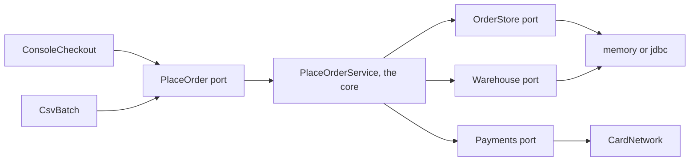

# Hexagonal Architecture with Spring Boot Pattern — Architecture Diagram

Everything points at the core. The core points at nothing outside itself.

Mermaid source

```mermaid
flowchart LR
    C["ConsoleCheckout"] --> P["PlaceOrder port"]
    B["CsvBatch"] --> P
    P --> S["PlaceOrderService, the core"]
    S --> O["OrderStore port"]
    S --> W["Warehouse port"]
    S --> Y["Payments port"]
    O --> M["memory or jdbc"]
    W --> M
    Y --> N["CardNetwork"]
```

