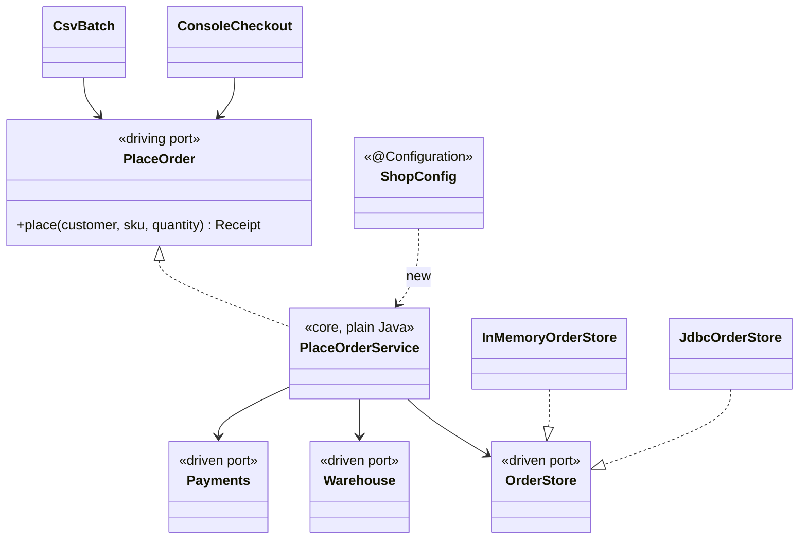

# Hexagonal Architecture with Spring Boot Pattern — Class Diagram

The core owns the ports. Adapters implement them. One configuration class joins them.

Mermaid source

```mermaid
classDiagram
    class PlaceOrder {
        <<driving port>>
        +place(customer, sku, quantity) Receipt
    }
    class PlaceOrderService {
        <<core, plain Java>>
    }
    class OrderStore {
        <<driven port>>
    }
    class Warehouse {
        <<driven port>>
    }
    class Payments {
        <<driven port>>
    }
    class ShopConfig {
        <<@Configuration>>
    }
    PlaceOrder <|.. PlaceOrderService
    PlaceOrderService --> OrderStore
    PlaceOrderService --> Warehouse
    PlaceOrderService --> Payments
    ShopConfig ..> PlaceOrderService : new
    InMemoryOrderStore ..|> OrderStore
    JdbcOrderStore ..|> OrderStore
    ConsoleCheckout --> PlaceOrder
    CsvBatch --> PlaceOrder
```

