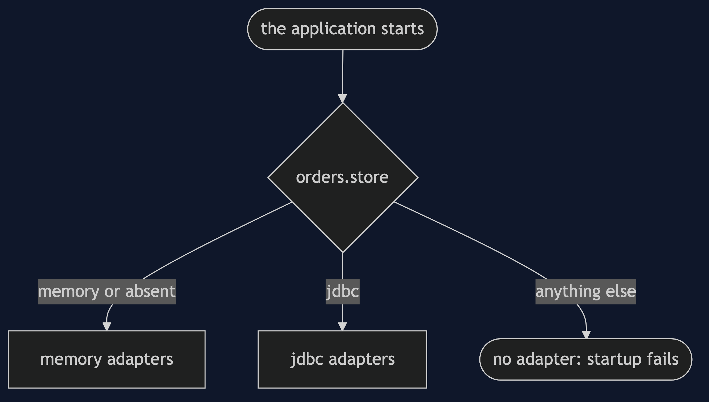
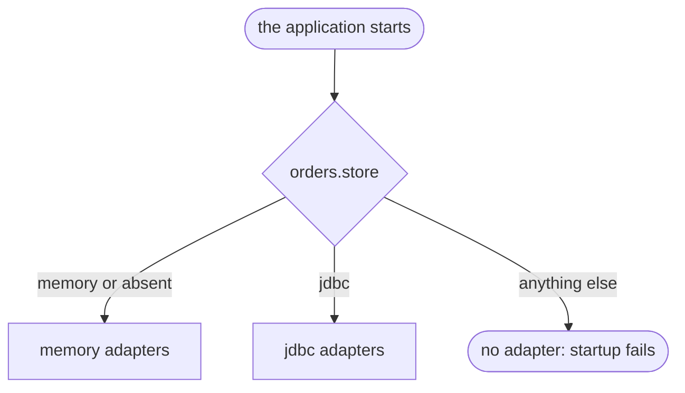

# Hexagonal Architecture with Spring Boot Pattern — Data Flow Diagram

How the storage adapter is chosen.

Mermaid source

```mermaid
flowchart TD
    Start(["the application starts"])
    Prop{"orders.store"}
    Mem["memory adapters"]
    Db["jdbc adapters"]
    None(["no adapter: startup fails"])
    Start --> Prop
    Prop -- memory or absent --> Mem
    Prop -- jdbc --> Db
    Prop -- anything else --> None
```

