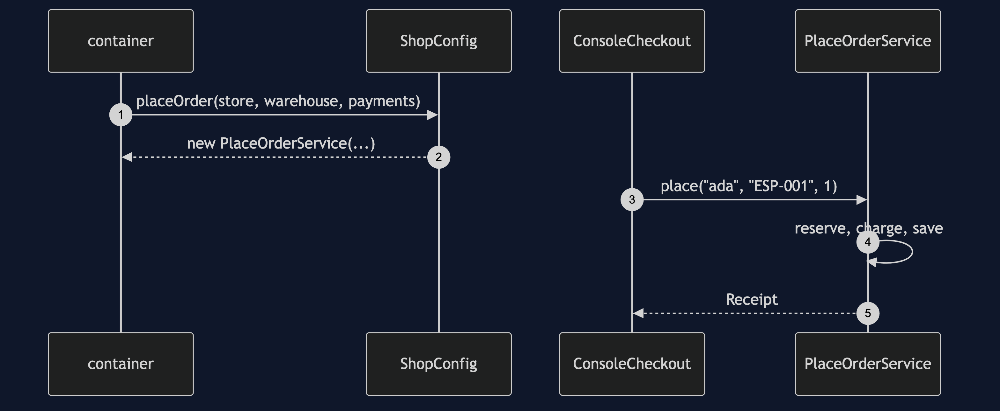
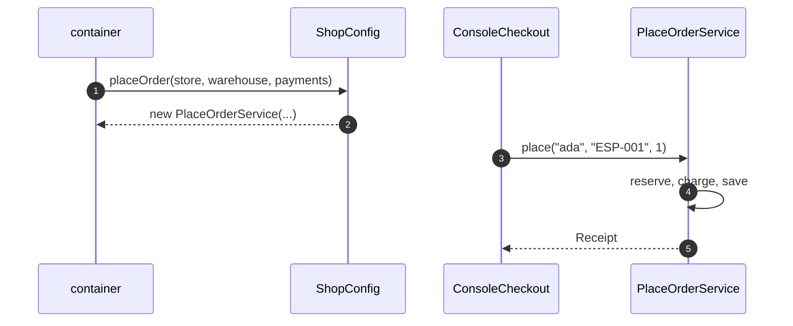

# Hexagonal Architecture with Spring Boot Pattern — Sequence Diagram

Written for a listener with the screen off.

Say it in words. At startup the container creates the adapters selected by the property. It then calls the configuration class, which builds the use case with the store, the warehouse and the payments adapter as its three arguments. Later the console adapter calls the port, the use case reserves stock, charges the card and saves the order, and the receipt goes back.

Mermaid source

The load-bearing sentence: **the core is built by hand inside one configuration method.**
