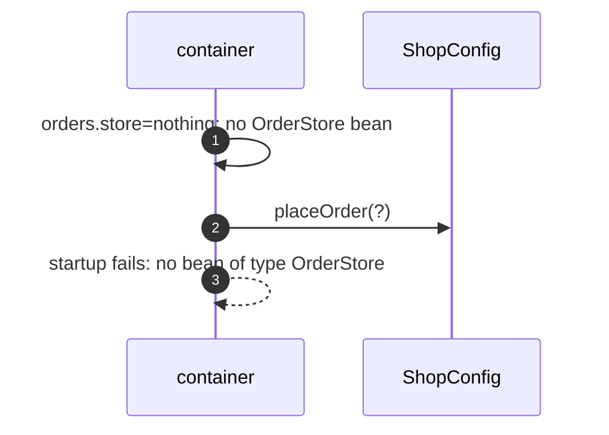

# Hexagonal Architecture with Spring Boot Pattern — UML Sequence Diagrams

Four sequences.

## 1. A Missing Adapter

Mermaid source

```mermaid
sequenceDiagram
    autonumber
    participant K as container
    participant F as ShopConfig
    K->>K: orders.store=nothing: no OrderStore bean
    K->>F: placeOrder(?)
    K-->>K: startup fails: no bean of type OrderStore
```

