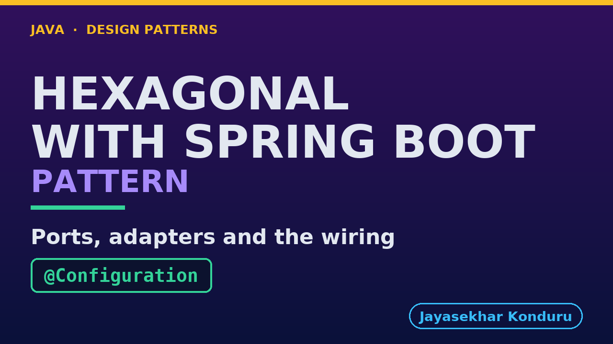

# YouTube — Hexagonal Architecture With Spring Boot Pattern

Everything needed to publish `video/hexagonal-architecture-with-spring-boot-pattern-explained.mp4`. Copy the fields straight out of this file.

Chapter timings are generated from the video's `.srt`. Re-run `python3 docs/make_youtube_docs.py hexagonal-architecture-with-spring-boot` after any change to the narration, or they will be wrong.

## Title

```
Hexagonal Architecture with Spring Boot
```

39 characters — under the 60 YouTube shows before truncating in search results.

## Description

The first two lines are what a viewer sees above the fold, so they carry the hook rather than the boilerplate.

```
Hexagonal Architecture in Java: the core stays a plain Java class that declares its ports, and the adapters become Spring beans chosen by configuration, like controllers plugged into the same games console. Explained with Spring Boot, using the same online store. We run one core on two storage adapters, through two different entry points, and with no framework at all. Then we watch a use case reach for Spring, and a port that has no adapter, and see what each costs. Spring wires the hexagon together, but only a rule keeps the core free of Spring.

CHAPTERS
00:00 Introduction
00:59 The Partner Project
01:24 Before The First Line
01:50 The Core Is Plain Java
02:07 Two Storage Adapters
02:32 Two Doors Into One Room
02:58 The Core Without A Container
03:16 A Use Case That Reaches For Spring
03:38 A Port With No Adapter
04:04 The Verdict
04:18 How To Recognise It
04:34 Where You Have Met This
04:42 What Was Used
04:53 What Is Real Here
05:03 When This Is Too Much
05:12 Thanks for Watching

SOURCE CODE, WRITTEN NOTES AND AN INTERACTIVE ANIMATION
https://github.com/jk-boot-up/java-design-patterns/tree/main/gradle-java/architectural-design-patterns/hexagonal-architecture-with-spring-boot-pattern

WHAT YOU NEED FIRST
Java 21 and a working knowledge of classes and interfaces. No prior design-pattern knowledge is assumed. The full prerequisites are in docs/prerequisites.md in the repository.
```

## Chapters

YouTube renders these as chapters only if there are at least three and the first is at `00:00`.

```
00:00 Introduction
00:59 The Partner Project
01:24 Before The First Line
01:50 The Core Is Plain Java
02:07 Two Storage Adapters
02:32 Two Doors Into One Room
02:58 The Core Without A Container
03:16 A Use Case That Reaches For Spring
03:38 A Port With No Adapter
04:04 The Verdict
04:18 How To Recognise It
04:34 Where You Have Met This
04:42 What Was Used
04:53 What Is Real Here
05:03 When This Is Too Much
05:12 Thanks for Watching
```

## Tags

```
hexagonal architecture, ports and adapters, spring boot, design patterns, java design patterns, gang of four, java 21, software design, clean code, object oriented design, java tutorial, ecommerce, programming tutorial
```

218 characters, under YouTube's 500 limit.

## Thumbnail



**Upload `docs/thumbnail.png`** — 1280×720, the size YouTube recommends, generated by `docs/make_thumbnails.py`. It is deliberately not the same image as the video's opening frame: a thumbnail is judged at about 360 pixels wide in a search result, so this one carries only the pattern name, one line of promise and one short piece of code, each set large enough to survive the shrink.

`video/poster.png` is the 1920×1080 opening frame, produced by the video build. It stays in the repository as the title card; it is not what gets uploaded.

YouTube will not pick the thumbnail up on its own — upload it under **Details → Thumbnail → Upload file**. A custom thumbnail requires a verified channel.

## Upload checklist

- [ ] Upload `video/hexagonal-architecture-with-spring-boot-pattern-explained.mp4` (1080p, H.264, 30 fps, AAC 48 kHz — already YouTube's recommended settings, no re-encode needed)
- [ ] Set the video language to **English** first, or the subtitle option may not appear
- [ ] Add subtitles: *Video elements → Add subtitles → Upload file → With timing* → `video/hexagonal-architecture-with-spring-boot-pattern-explained.srt`
- [ ] Upload `docs/thumbnail.png` as the thumbnail — do not let YouTube auto-pick a frame
- [ ] Paste the title, description and tags from above
- [ ] Add to the **Java Design Patterns** playlist, in learning order
- [ ] Wait for 1080p processing before sharing the link — code slides are unreadable at 360p

## Cards and end screen

End screen links to whichever pattern video goes up next — set it at upload time rather than assuming an order.

Add a card partway through pointing at the playlist, so a viewer who arrives at this pattern from search can find the rest of the series.

## Runtime

Approximately 05:48, narrated at 145 words per minute.
