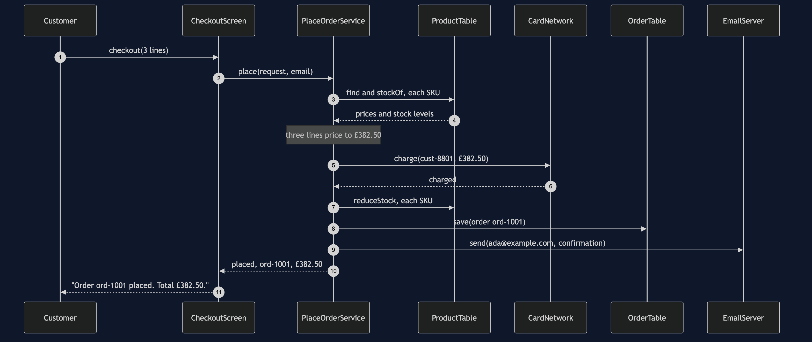
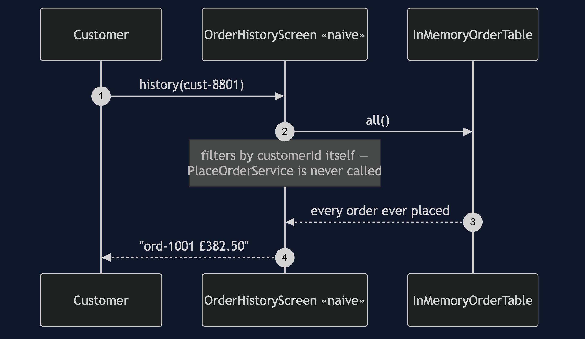
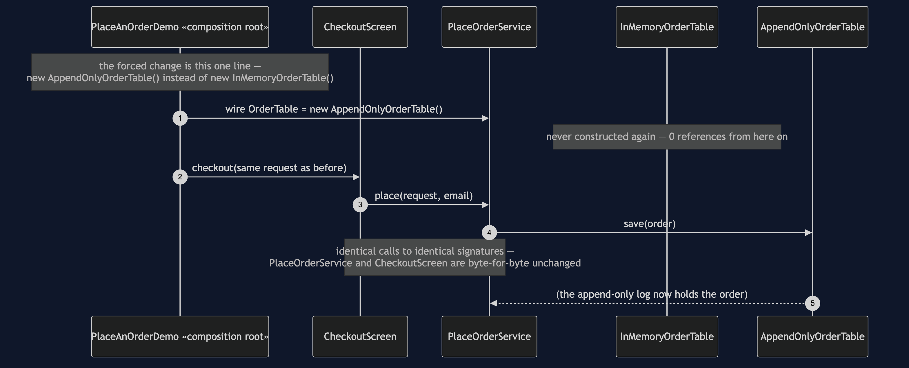
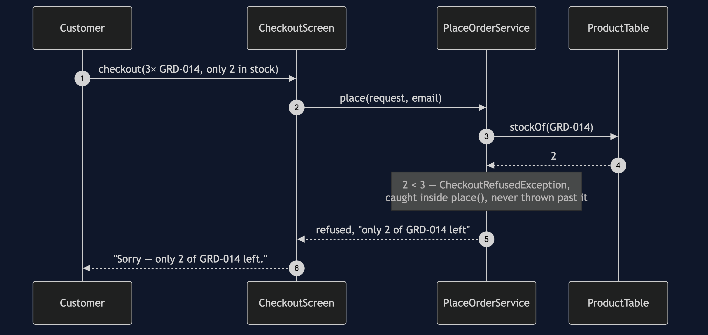

# Layered Architecture Pattern

In this category the structure *is* the content, so here it is before a word
of explanation:

```
src/main/java/com/jk/explore/layered/
├── PlaceAnOrderDemo.java          composition root — the five acts
├── ForcedChange.java              counts the bill, from real files on disk
│
├── presentation/                  ← may depend only on application
│   └── CheckoutScreen.java
├── application/                   ← may depend only on infrastructure
│   ├── PlaceOrderService.java
│   ├── PlaceOrderRequest.java
│   └── PlaceOrderResult.java
├── domain/                        ← depends on nothing else, anywhere
│   ├── Order.java
│   ├── OrderLine.java
│   ├── OrderStatus.java
│   ├── Product.java
│   ├── Money.java
│   └── CheckoutRefusedException.java
├── infrastructure/                ← the bottom layer
│   ├── OrderTable.java             «interface» — the forced change swaps this
│   ├── InMemoryOrderTable.java
│   ├── AppendOnlyOrderTable.java   the replacement
│   ├── ProductTable.java
│   ├── CardNetwork.java
│   ├── EmailServer.java
│   └── PaymentDeclinedException.java
│
└── naive/                          ← kept on purpose, outside the real layers
    ├── EverythingOrderService.java         no layers at all
    └── presentation/
        └── OrderHistoryScreen.java         the shortcut — skips application
```

Seventeen classes make the real architecture; two more show what it replaces.
Every arrow between the four real packages points downward, one layer at a
time, and `src/test/java/.../layered/ArchitectureTest.java` is what checks
that this listing stays true.

**Split a program into stacked layers — presentation, application, domain,
infrastructure — where each layer depends only on the layer directly beneath
it, and enforce that rule with a test rather than a diagram.**

This is the reference project for the
[architectural-design-patterns](..) category: the architecture nearly every
reader already has, and the one whose failure mode everyone has lived with —
layers that exist as folders and are violated by one convenient call that
nothing in the build objects to.

## Run

```bash
./gradlew run
```

Five acts, then the feature the whole category shares.

Act one is the version with no layers at all.

```
ONE. No layers at all.
  ord-1001 £382.50
  it works. 74 lines, and the pricing cannot be tested
  without building the catalogue map, the order map and the outbox.
```

Act two is the real four layers, working.

```
TWO. Four layers, and the same order.
  Order ord-1001 placed. Total £382.50.
  stock now  ESP-001 3, GRD-014 1, BNS-220 38
  the screen has two imports, both of them the application layer.
  it does not know the word 'map'.
```

Act three is the shortcut, and it is this project's whole lesson.

```
THREE. The one call that ruins them.
  ord-1001 £382.50
  that screen skipped the application layer and read storage directly.
  it compiles, it is tidy, the tests pass, and it shipped.
  NOTHING IN THE BUILD OBJECTED.
```

Act four is the rule, written where a build can read it — see
[Test](#test) below for what it prints when it goes red.

Act five is the forced change, counted.

```
FIVE. Replace the entire storage layer.
  store is now an append-only log, read backwards
  Order ord-1001 placed. Total £382.50.
  orders held: 1

  FORCED CHANGE: replace the storage layer
    a map keyed by order id  ->  an append-only log, read backwards

    files added     : 1   infrastructure/AppendOnlyOrderTable.java
    files modified  : 1   PlaceAnOrderDemo.java (the composition root)
    lines changed   : 1
    classes in the four layers : 17
    of those, opened           : 1
    of those, never opened     : 16

  AND THE ONE THAT TOOK THE SHORTCUT
    naive/presentation/OrderHistoryScreen.java imports InMemoryOrderTable
    it went straight to storage, so the swap does not compile for it
    every screen that went through the application layer: untouched
```

And the acceptance line every project in this category prints identically:

```
ACCEPTANCE
  order ord-1001 for cust-8801: PLACED, 3 lines, £382.50
  stock ESP-001 3, GRD-014 1, BNS-220 38
  charged cust-8801 £382.50 once
  sent 1 confirmation to ada@example.com
  refused: not enough stock, unknown product, payment declined
```

## Test

```bash
./gradlew test
```

Eighteen tests. Three assert the dependency rule holds on the real four
layers; one widens the same rule to the `naive` package on purpose and
asserts it **fails**, printing the exact message a developer would see. The
rest cover the use case directly — pricing, the three refusal reasons, that
a declined card leaves no order and no reduced stock behind, and that the
demo's output is deterministic:

```
Architecture Violation [Priority: MEDIUM] - Rule 'no classes that reside in
a package '..presentation..' should depend on classes that reside in a
package '..infrastructure..'' was violated (1 time):
Class <...naive.presentation.OrderHistoryScreen> depends on class
<...infrastructure.InMemoryOrderTable> in (OrderHistoryScreen.java:24)
```

A green test that has never been seen red proves nothing. This one has been
seen red, on purpose, and the message names the class and what it reached
for.

## Technologies and versions

| What | Version | Why it is here |
| --- | --- | --- |
| Java | 21 | The repository standard, via the Gradle toolchain block |
| Gradle | 9.2.1 | The wrapper in this directory; no separate install needed |
| JUnit 5 | 5.10.2 | Test runner |
| **ArchUnit** | **1.5.0** | The one library this whole category takes, and the reason is the category's thesis: a dependency rule written as an ArchUnit test *is* the architecture, executably. `noClasses().that().resideInAPackage("..presentation..").should().dependOnClassesThat().resideInAPackage("..infrastructure..")` reads as English, fails with the offending class named, and turns a whiteboard promise into a build failure. It is a test-only dependency — nothing in `src/main` knows it exists. |

No Spring, no database, no web framework, no container. The whole project —
code, tests, documents and video — runs offline with a JDK and nothing else.

## Learning Material

| Document | What it covers |
| --- | --- |
| [`docs/problem-statement.md`](docs/problem-statement.md) | The four layers, and the one call that ruins them |
| [`docs/layered-architecture-pattern-explained.md`](docs/layered-architecture-pattern-explained.md) | The pattern, the rule as a test, the forced change, and the bill |
| [`docs/class-diagram.md`](docs/class-diagram.md) | The types, and which arrows are missing |
| [`docs/architecture-diagram.md`](docs/architecture-diagram.md) | What is allowed to know about what |
| [`docs/data-flow-diagram.md`](docs/data-flow-diagram.md) | One order, and the gates it has to pass |
| [`docs/sequence-diagram.md`](docs/sequence-diagram.md) | Who calls whom, in order — written for a listener with the screen off |
| [`docs/uml-diagram.md`](docs/uml-diagram.md) | Four sequences: the real call, the shortcut, the forced change, a refusal |
| [`docs/animation.html`](docs/animation.html) | Five steps in a browser, from no layers to the forced change |
| [`docs/prerequisites.md`](docs/prerequisites.md) | What you need to know, and what you explicitly do not |
| [`docs/session.md`](docs/session.md) | A one-hour taught session with three exercises |
| [`docs/spec.md`](docs/spec.md) | The generated specification, with measured test counts and timings |
| [`docs/youtube.md`](docs/youtube.md) | Title, description and chapters for the video |

### The pattern in one picture

The class diagram, and the single most important thing on it is which arrows
are missing. `CheckoutScreen` has no line to anything in `infrastructure`.
`Order`, `Money` and `Product` have no line to anything outside `domain`.


### What is allowed to know about what

Four stacked boxes, every solid arrow pointing down one layer at a time, and
one dashed box off to the side showing the shortcut this project's
architecture test exists to catch.


### How one order moves

Every gate that can refuse the order sits before the step it protects, so a
refusal never leaves a half-placed order behind.


### Who calls whom, in order

The sequence written to work with the screen off: a customer calls the
screen, the screen calls the service and nothing else, and the service
charges the card before it writes anything down.


### All four sequences

The full set from [`docs/uml-diagram.md`](docs/uml-diagram.md): the real
call, the shortcut, the forced change, and a refusal.

**One. One order, through all four layers.** The call travels straight down
and never sideways.



**Two. The shortcut — a screen that skips the application layer.** No
`PlaceOrderService` box appears on this diagram at all.



**Three. The forced change — storage is replaced, nothing above notices.**
Sixteen of seventeen classes make no appearance in this diagram.



**Four. A refusal — not enough stock.** `CardNetwork` never appears; the
stock check runs first.



### Video

The narrated walkthrough is built from
[`video/scenes.py`](video/scenes.py) by
[`video/build_video.sh`](video/build_video.sh). The rendered file is not
committed — see the repository README for why.

## When this is too much

Four layers and an architecture test are worth their weight for anything
with more than one caller of the same business logic, or anything expected
to outlive its first storage choice. They are not worth it for a script that
reads a file, does one calculation, and prints a result once — a four-package
skeleton around fifteen lines of real logic is not layering, it is packaging.
If writing the request object, the result object and the service method for
a new screen would take longer than the screen is worth, the layers have
stopped paying for themselves.

## Where this sits

This is project 63, first of the five in
[`architectural-design-patterns`](..) — the category's reference project,
built and published first because it is the architecture nearly every reader
already has.

The next project, **MVC**, takes the same separation to the user-facing edge.
The one after that, **Hexagonal Architecture**, changes the one thing this
project admits it does not fix: the application layer still names
infrastructure by package, because the storage interface is defined down
there rather than up here. Moving that interface into the core, so storage
implements it instead of defining it, is the entire difference between this
project and the next one — and it is only one move.

## Also available with a framework

[Layered Architecture with Spring Boot Pattern](../layered-architecture-with-spring-boot-pattern) reruns this idea on a real framework, and shows what the framework adds and where it can undo the pattern. Watch this project first.
