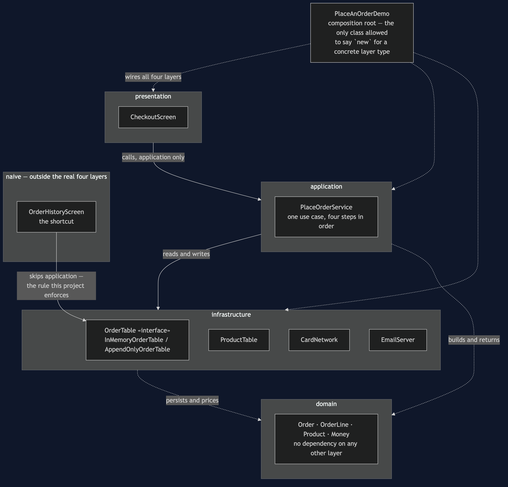
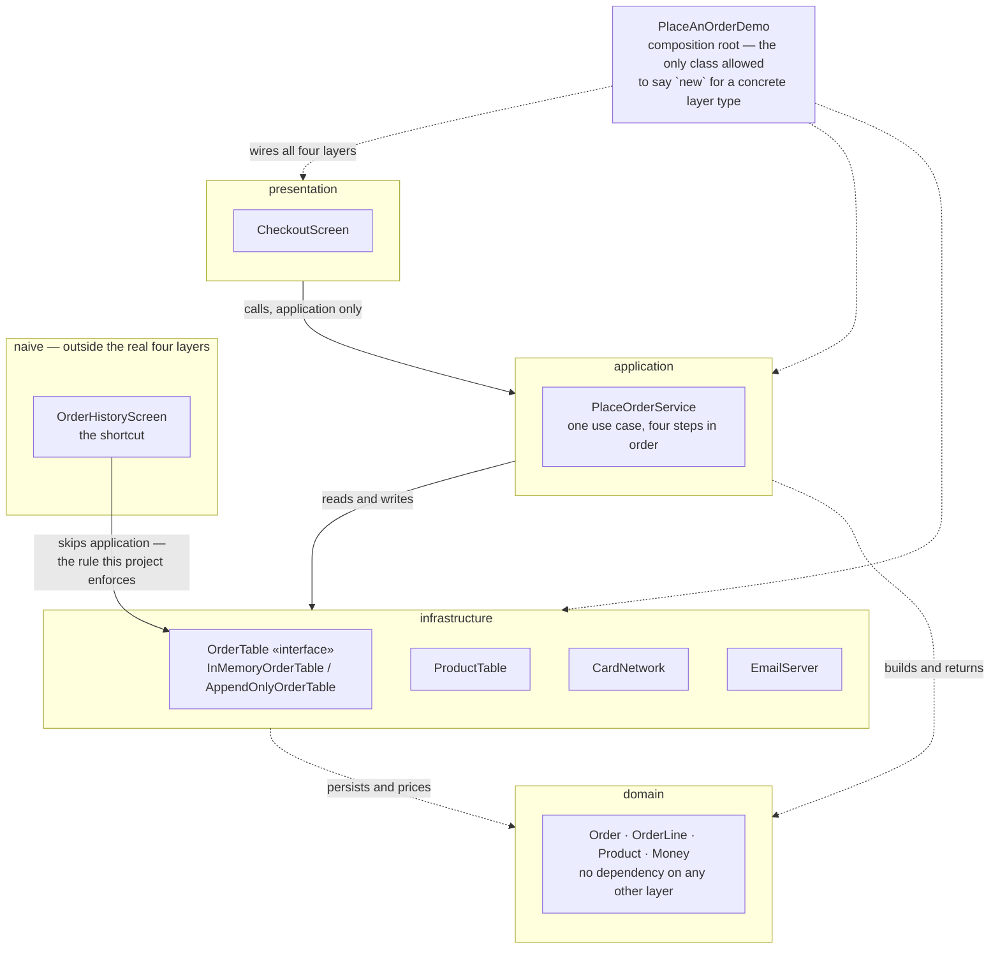

# Layered Architecture Pattern — Architecture Diagram

Where each class sits, and which direction every arrow between the layers is
allowed to point. The class diagram shows the types and the sequence diagrams
show the order of events; this one answers the question those two cannot,
which is **what is allowed to know about what**.

Read it as four stacked boxes, top to bottom: presentation, application,
domain, infrastructure. Every arrow between boxes points downward, to the
box directly beneath it, and there are no arrows pointing up or sideways
between real-layer boxes anywhere on this diagram. The composition root sits
outside all four boxes, to one side, because it is the one place allowed to
know about every layer at once — that is the entire reason to have a
composition root rather than let each class construct its own dependencies.

The naive counterexample is drawn as a fifth, dashed box, off to the side,
with one arrow that crosses straight from presentation-shaped code to
infrastructure — skipping application entirely. That arrow is the only one on
this diagram that is not downward-one-layer, and it is drawn in the project's
`naive` packages so the architecture test has a real target to catch.

Mermaid source

## Reading The Diagram

**Every solid arrow between real layers points down, one layer at a time.**
`presentation` reaches `application`; `application` reaches
`infrastructure`. Nothing reaches back up, and `ArchitectureTest` is what
turns that sentence from a claim about this diagram into a claim about the
build.

**`domain` has no outgoing solid arrow to another layer at all.** The dotted
lines touching it mean "builds" and "persists" — application constructs an
`Order`, infrastructure stores one — but the arrowheads point *into* domain,
never out of it. `Order`, `Money` and `Product` do not know that a
presentation layer or an infrastructure layer exists.

**`PlaceAnOrderDemo` is drawn outside all four boxes.** It is the composition
root: the one class that says `new AppendOnlyOrderTable()` or
`new InMemoryOrderTable()`, and hands the result to the layers that only know
the interface. That is why the forced change later in this project is one
line in this one box and nowhere else.

**The dashed box is not part of the architecture.** It exists in the source
tree, in `naive` packages, as the thing the real four layers are being
contrasted against. Its one arrow — `OrderHistoryScreen` straight to
`OrderTable`'s concrete implementation — is the only line on this diagram
that is not a downward step of one layer, and it is the line
`ArchitectureRuleCatchesTheShortcutTest` widens the dependency rule to catch.
