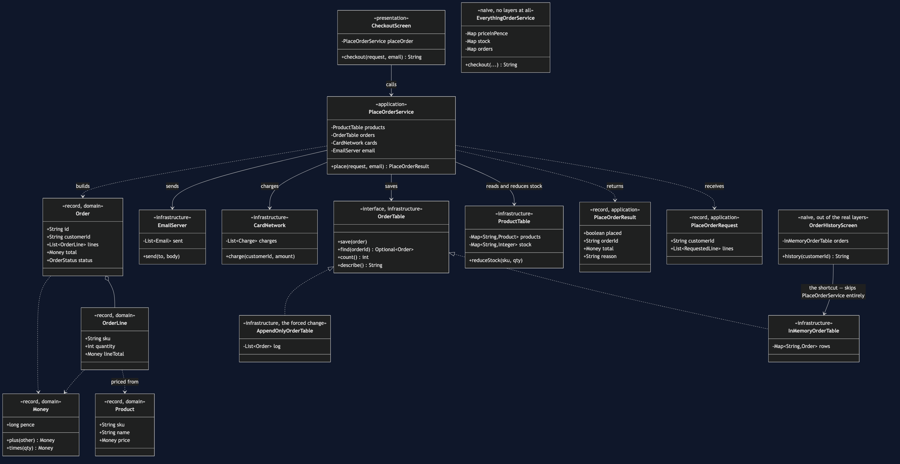
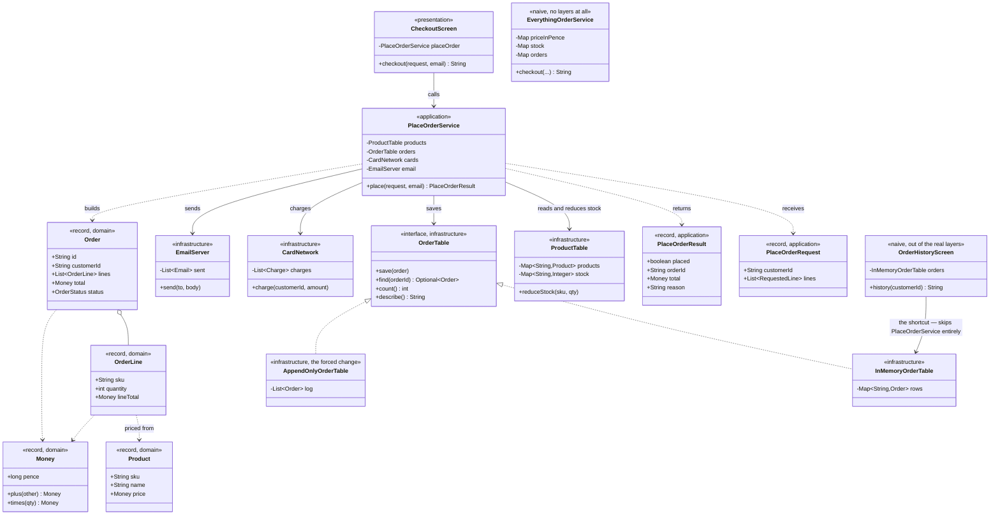

# Layered Architecture Pattern — Class Diagram

Shows the static structure of the four layers, the interface that lets the
storage layer be replaced, and the two naive classes kept in the project on
purpose: one with no layers at all, and one that shows a layer boundary
skipped.

The single most important thing on this diagram is which arrows are missing.
`CheckoutScreen` has no line to anything in `infrastructure`. `Order`,
`Money` and `Product` have no line to anything outside `domain`. Those
absences are the architecture; the arrows that do exist are almost all
downward, one layer to the one beneath it.

Mermaid source

## Reading The Diagram

**`CheckoutScreen` names exactly one thing: `PlaceOrderService`.** No import
of `OrderTable`, `ProductTable`, `CardNetwork` or anything else in
`infrastructure`. If a future edit adds one, `ArchitectureTest` fails before
the diagram would ever need updating to admit it.

**`PlaceOrderService` names all four `infrastructure` interfaces, and that is
allowed — and is this project's honest cost.** The application layer sits
directly above infrastructure, so it is the layer permitted to name it. Its
imports are `OrderTable`, `ProductTable`, `CardNetwork` and `EmailServer`, all
defined in the package below. That direction of dependency — application
reaching down into infrastructure for the very names it needs — is exactly
what Hexagonal Architecture, the next project in this category, changes.

**`Order`, `OrderLine`, `Product` and `Money` have no outgoing arrow to
anything above or below `domain`.** An order and a price are true whether or
not anybody is storing them or showing them to a customer, and the diagram
has nothing to draw there because there is nothing to draw.

**`OrderTable` is an interface with two implementations, and only one of
them is ever imported by name outside `infrastructure`** — `InMemoryOrderTable`,
and only by the naive screen. Everywhere in the real four layers, the type
that travels is `OrderTable`. That is what makes `AppendOnlyOrderTable`
addable without editing `PlaceOrderService`, `CheckoutScreen`, or any domain
class.

**`OrderHistoryScreen` is drawn with a line straight to `InMemoryOrderTable`,
skipping `PlaceOrderService` entirely.** It is the only arrow on this diagram
that crosses more than one layer, and it is drawn that way on purpose: it is
the shortcut the whole project is about, kept in the codebase so the
architecture test has something real to catch.
