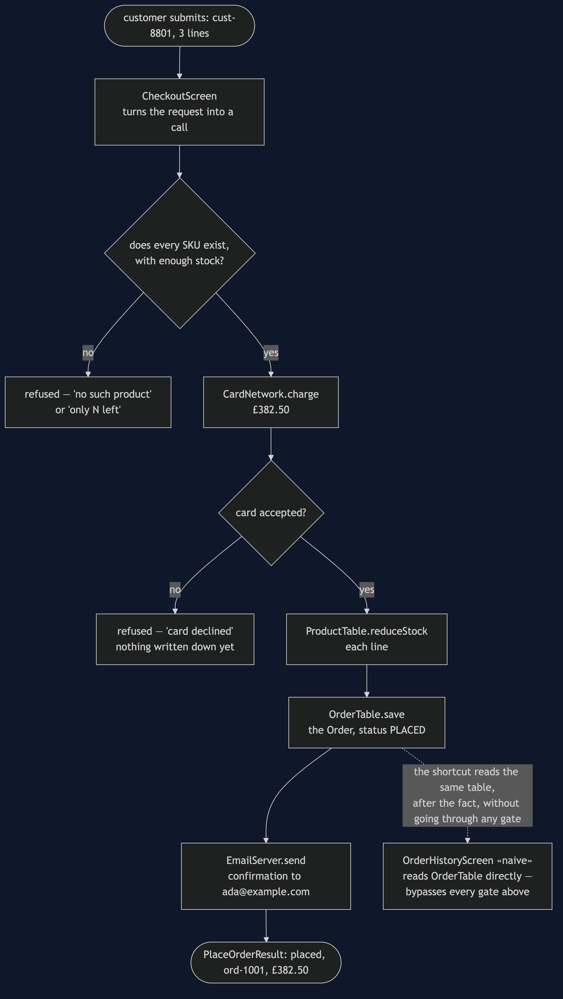
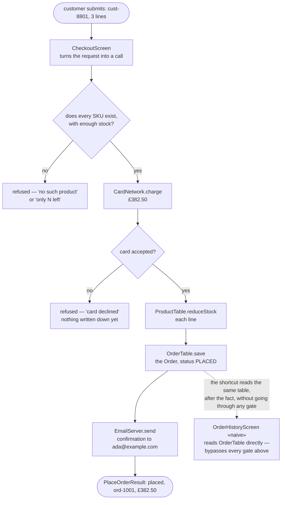

# Layered Architecture Pattern — Data Flow Diagram

One order, followed from the moment a customer submits it to the moment a
confirmation email is sent, with each gate it has to pass drawn as a
decision. The architecture diagram says what is allowed to know about what;
this one says what actually happens to Ada's £382.50 order, in order.

Two things are worth watching as the request moves down the page. First, it
changes shape at every layer boundary: a `PlaceOrderRequest` going in,
`OrderLine`s and an `Order` appearing partway down, a `PlaceOrderResult`
coming back out. Nothing downstream ever sees the original request object
directly; each layer hands the next one exactly what it needs and nothing
else. Second, every gate that can refuse the order — unknown product, not
enough stock, card declined — refuses it **before** anything is written down,
which is why a refusal never leaves a half-placed order behind.

Mermaid source

## Reading The Diagram

**Every gate sits before the step it protects, never after.** Stock is
checked before the card is charged; the card is charged before the order is
saved. Follow the "no" branches: both lead straight to a refusal and neither
one passes through `Save`, which is what keeps a declined card from ever
producing a half-recorded order.

**The request is validated once, at the top, and never re-checked lower
down.** `PlaceOrderService.priceEveryLine` is the only gate that reads stock
and prices; `Reduce` and `Save`, further down, trust the `Order` it already
built rather than re-deriving it. Re-validating at every layer would be
theatre — the point of the gate is that it runs exactly once, where the
information to make the decision first becomes available.

**The dashed line is the shortcut, and it touches the diagram at only one
point: `Save`.** `OrderHistoryScreen` reads the same `OrderTable` that
`Save` writes to, but it does not enter through `Screen`, `Price`, `Charge`,
`Declined` or `Reduce` — it reaches straight past every gate on this page to
read the result of a checkout it played no part in. That single dashed line
is the entire shortcut this project's architecture test exists to catch, and
it is dashed rather than solid because it is not a step the feature takes —
it is the failure mode being illustrated.
