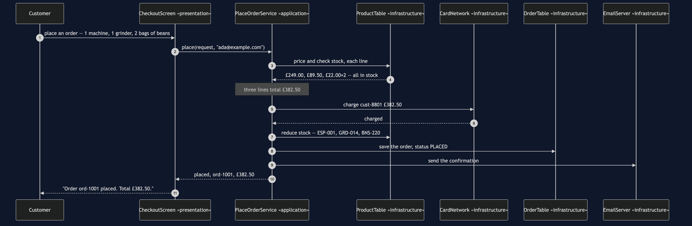
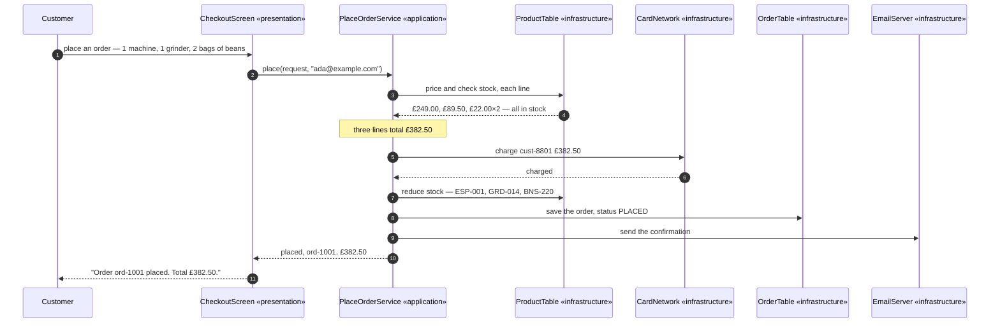

# Layered Architecture Pattern — Sequence Diagram

One order, placed, in the order the calls actually happen. The architecture
diagram says what is allowed to know about what and the data flow diagram
shows the gates the order has to pass; this one says **who calls whom, and
in what order**, which is the question a listener with the screen off needs
answered in words rather than in a picture.

Read it as four names, spoken in order. A customer calls the checkout screen.
The checkout screen calls the order-placing service — and calls nothing
else, because the screen's only job is to turn what was typed into one call
and turn the answer into words. The order-placing service is where the real
work happens: it asks the product table for prices and stock, it charges the
card, and only after the card has been charged does it reduce the stock, save
the order, and send the confirmation email. Notice the order of those last
three: charge first, then everything that cannot be easily undone. A card
that gets declined stops the sequence before a single line has been written
down anywhere.

The screen never speaks to the product table, the card network, the order
table or the email server directly. Every one of those four conversations
happens one level below it, inside the service, and the screen only ever
hears the answer once, at the end, as a single sentence: placed, or refused,
and why.

Mermaid source

Say the load-bearing sentence aloud, because it is the one detail a picture
cannot carry on its own: **the card is charged before anything is written
down.** Do the two in the other order — save the order, reduce the stock,
then charge — and a declined card leaves an order sitting in storage and
stock missing from the shelf, with nothing anywhere recording that neither
of those should have happened. Charging first means a decline stops the
whole sequence before a single fact has changed.

For the shortcut that skips this sequence entirely, the forced change that
replaces the storage box, and a refusal that never reaches the card network,
see [`uml-diagram.md`](uml-diagram.md) — the rejected designs and the failure
modes live there, this document only carries the one sequence that works.
