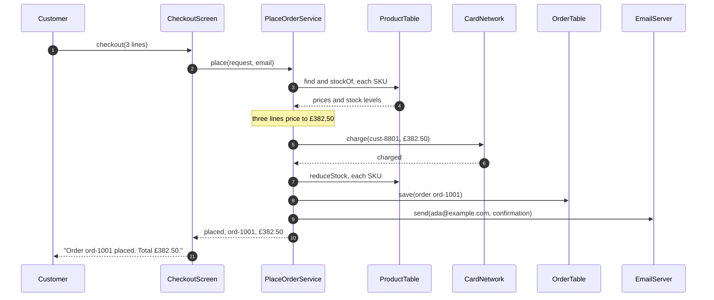
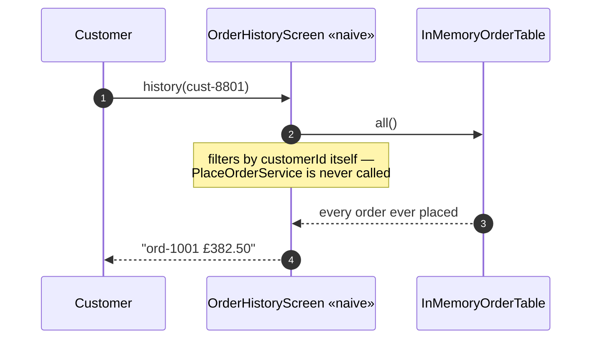
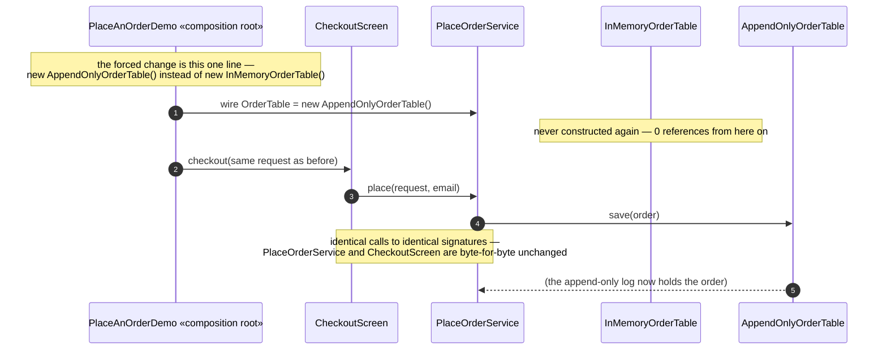
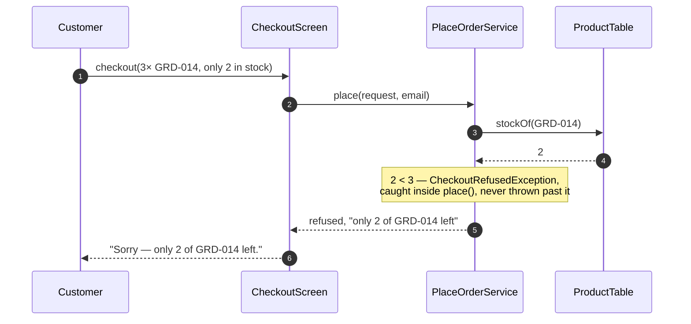

# Layered Architecture Pattern — UML Sequence Diagrams

Four sequences. The first is the pattern working exactly as intended, and the
one rendered as this document's image. The next three are the shortcut, the
forced change, and a refusal — the three moments the video and the README
both point back to.

## 1. One Order, Through All Four Layers

The call travels straight down — presentation to application to
infrastructure, with domain objects built along the way — and never sideways.

Mermaid source

Read step 6 before step 9. The card is charged before the order is written
down anywhere. Reverse that order and a declined card would leave stock
reduced and an order half-recorded with nothing to say either should not have
happened; charging first means a refusal throws before anything has changed.

## 2. The Shortcut — A Screen That Skips The Application Layer

The naive `OrderHistoryScreen` reaches straight into storage. It works, and
that is the problem this project exists to fix.

Mermaid source

Compare this with sequence 1. There is no `PlaceOrderService` box on this
diagram at all — the application layer is not merely bypassed, it is absent
from the call entirely. `ArchitectureRuleCatchesTheShortcutTest` is what
turns this picture into a build failure rather than a code-review question.

## 3. The Forced Change — Storage Is Replaced, Nothing Above Notices

Everything above `infrastructure` is called exactly as before; only the box
at the bottom is a different class.

Mermaid source

Sixteen of the project's seventeen classes across the four layers make no
appearance in this diagram at all, because the change did not reach them.
That is the number the forced-change report prints, and this is what it looks
like as a sequence rather than a count.

## 4. A Refusal — Not Enough Stock

A refusal is a returned value, not a crash, and it never reaches the card
network.

Mermaid source

Notice what never appears on this diagram: `CardNetwork`. The stock check
happens first, inside `priceEveryLine`, before the method reaches the line
that charges a card. Nothing is refunded here, because nothing was ever
taken.
