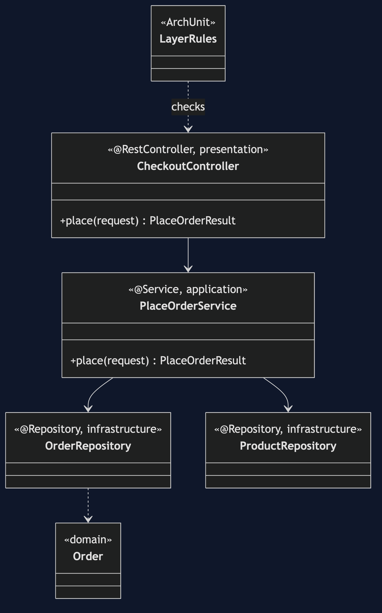
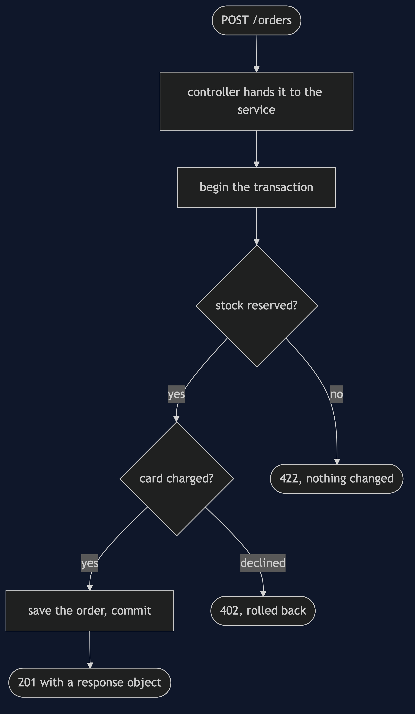
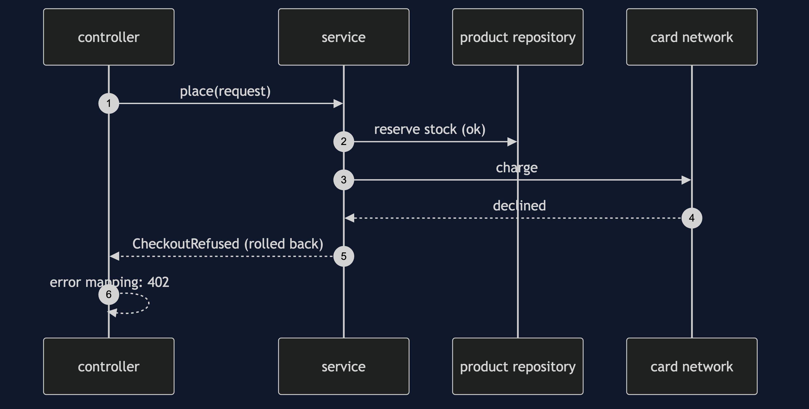

# Layered Architecture with Spring Boot Pattern

```
src/main/java/com/jk/explore/layeredspring/
├── ShopApplication.java        the entry point and the six acts
├── LayerRules.java             the layering rule, in ArchUnit
├── presentation/               CheckoutController, ErrorMapping
├── application/                PlaceOrderService and its request and result
├── domain/                     Order, CheckoutRefused
├── infrastructure/             two repositories and a card network
└── naive/                      ShortcutController, never scanned
```

**In Spring Boot the layers are stereotypes, and the layering rule is not enforced. A test has to enforce it.**

This project is the framework version of [Layered Architecture](../layered-architecture-pattern). That project built the mechanism by hand. This one shows the same idea inside Spring Boot. It does not re-teach the pattern. It shows what Spring Boot adds, the failures that are its own, and what it costs.

## Run

```bash
./gradlew run
```

Six acts. The partner project, Layered Architecture, built the mechanism by hand. Here the same idea runs through Spring Boot, and every count comes from real output.

```
ONE. Four layers, one real request.
  POST /orders -> 201 {"orderId":"ORD-000001","totalPence":30000,"status":"PAID"}
  stock of ESP-001 afterwards: 4.
  controller, service, repository and record: each is one layer, marked by a Spring stereotype.
TWO. One transaction, in the application layer.
  the card is declined after the stock was reserved: 402 the card was declined
  stock of ESP-001 afterwards: 4. the reservation was rolled back.
THREE. Failures become statuses in one place.
  ten machines when four are left: 422 not enough ESP-001 in stock
  the domain named the reason. only the presentation layer knows what number it becomes.
FOUR. The shortcut compiles, starts and answers.
  GET /raw-orders/ORD-000001 -> 200 {"id":"ORD-000001","customer":"ada","sku":"ESP-001","quantity":1,"totalPence":30000,"costPence":21000,"status":"PAID"}
  a controller that reads the repository directly. Spring did not object.
FIVE. It also leaks.
  the shortcut's answer contains the shop's cost price: true.
  the layered answer contains it: false.
SIX. A rule the container does not have.
  the layering rule, run over every class in the project: 3 violations.
  every one is in ShortcutController: true. the real four layers have none.
  Spring wires by type. Only a test can say a layer is not allowed to be there.
```

## Test

```bash
./gradlew test
```

2 test classes, 8 test methods, offline, with each Spring context started inside the test, and no server.

## Technologies and versions

| What | Version | Why it is here |
| --- | --- | --- |
| Java | 21 | The repository standard, via the Gradle toolchain block |
| Gradle | 9.2.1 | The wrapper in this directory; no separate install needed |
| Spring Boot | 4.1.1 | The container, the web server and transactions |
| H2 | managed | An in-memory database |
| ArchUnit | 1.5.0 | The layering rule |
| JUnit 5 | 5.10.2 | Test runner |

See [`docs/dependencies.md`](docs/dependencies.md).

## Learning Material

| Document | What it covers |
| --- | --- |
| [`docs/problem-statement.md`](docs/problem-statement.md) | The partner's layers, and what is new |
| [`docs/layered-architecture-with-spring-boot-pattern-explained.md`](docs/layered-architecture-with-spring-boot-pattern-explained.md) | Layers as Spring stereotypes, and what is not enforced |
| [`docs/class-diagram.md`](docs/class-diagram.md) | The types |
| [`docs/architecture-diagram.md`](docs/architecture-diagram.md) | Four layers over real HTTP |
| [`docs/data-flow-diagram.md`](docs/data-flow-diagram.md) | A request through the layers |
| [`docs/sequence-diagram.md`](docs/sequence-diagram.md) | Written for a listener with the screen off |
| [`docs/uml-diagram.md`](docs/uml-diagram.md) | Four sequences |
| [`docs/animation.html`](docs/animation.html) | The six acts in a browser |
| [`docs/prerequisites.md`](docs/prerequisites.md) | What you need to know |
| [`docs/session.md`](docs/session.md) | A one-hour taught session |
| [`docs/spec.md`](docs/spec.md) | The generated specification |
| [`docs/youtube.md`](docs/youtube.md) | Title, description and chapters |
| [`docs/dependencies.md`](docs/dependencies.md) | What Spring Boot is, what it costs, and that skipping this project loses none of the pattern |

### The pattern in one picture



### Where each piece sits


### How one request moves



### Who calls whom, in order



### All four sequences


### Video

Built from [`video/scenes.py`](video/scenes.py) by
[`video/build_video.sh`](video/build_video.sh). The rendered file is not
committed; see the repository README for why.

## Where you have already met this

Most Spring Boot applications you will ever open.

## When this is too much

For a small script with one table, four layers are more ceremony than help.

## Where this sits

This project pairs with [Layered Architecture](../layered-architecture-pattern), and is a framework version in [`architectural-design-patterns`](..).
