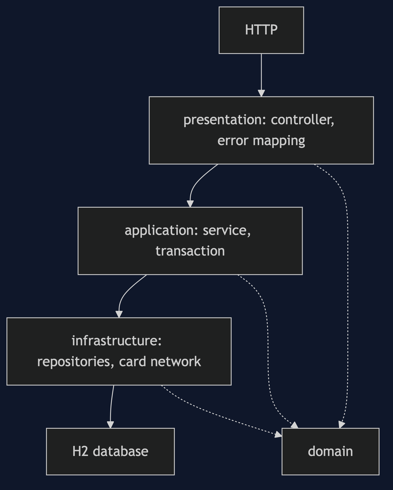
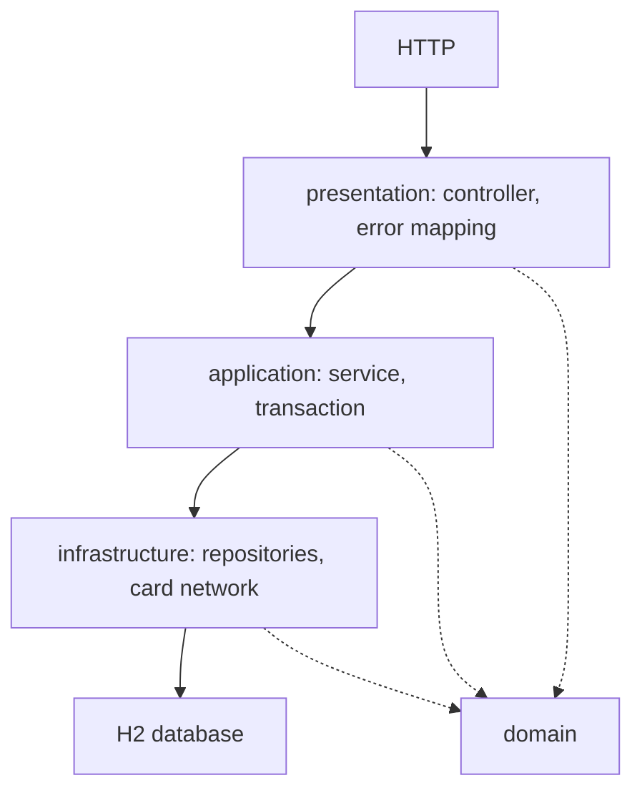

# Layered Architecture with Spring Boot Pattern — Architecture Diagram

Requests travel down, and each layer depends only on the one below.

Mermaid source

```mermaid
flowchart TD
    H["HTTP"] --> P["presentation: controller, error mapping"]
    P --> A["application: service, transaction"]
    A --> I["infrastructure: repositories, card network"]
    I --> D["H2 database"]
    P -.-> M["domain"]
    A -.-> M
    I -.-> M
```

