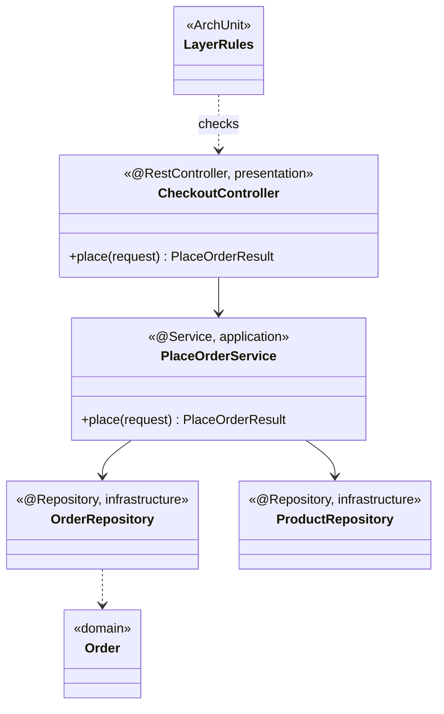

# Layered Architecture with Spring Boot Pattern — Class Diagram

One class per layer, and the rule that checks them.

Mermaid source

```mermaid
classDiagram
    class CheckoutController {
        <<@RestController, presentation>>
        +place(request) PlaceOrderResult
    }
    class PlaceOrderService {
        <<@Service, application>>
        +place(request) PlaceOrderResult
    }
    class OrderRepository {
        <<@Repository, infrastructure>>
    }
    class ProductRepository {
        <<@Repository, infrastructure>>
    }
    class Order {
        <<domain>>
    }
    class LayerRules {
        <<ArchUnit>>
    }
    CheckoutController --> PlaceOrderService
    PlaceOrderService --> OrderRepository
    PlaceOrderService --> ProductRepository
    OrderRepository ..> Order
    LayerRules ..> CheckoutController : checks
```

