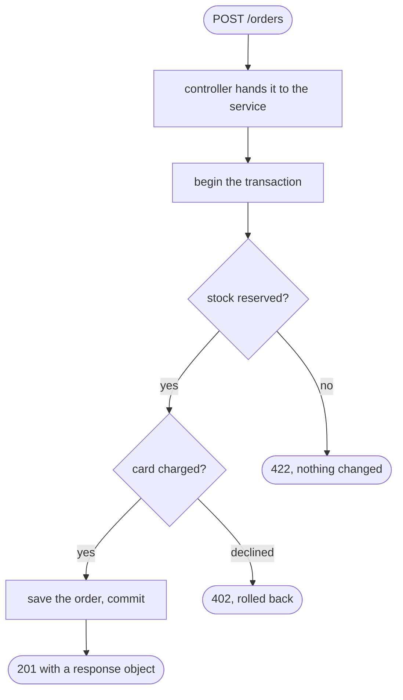

# Layered Architecture with Spring Boot Pattern — Data Flow Diagram

What happens to an order request.

Mermaid source

```mermaid
flowchart TD
    Req(["POST /orders"])
    C["controller hands it to the service"]
    T["begin the transaction"]
    R{"stock reserved?"}
    Pay{"card charged?"}
    Save["save the order, commit"]
    Refuse(["422, nothing changed"])
    Roll(["402, rolled back"])
    Ok(["201 with a response object"])
    Req --> C --> T --> R
    R -- no --> Refuse
    R -- yes --> Pay
    Pay -- declined --> Roll
    Pay -- yes --> Save --> Ok
```

